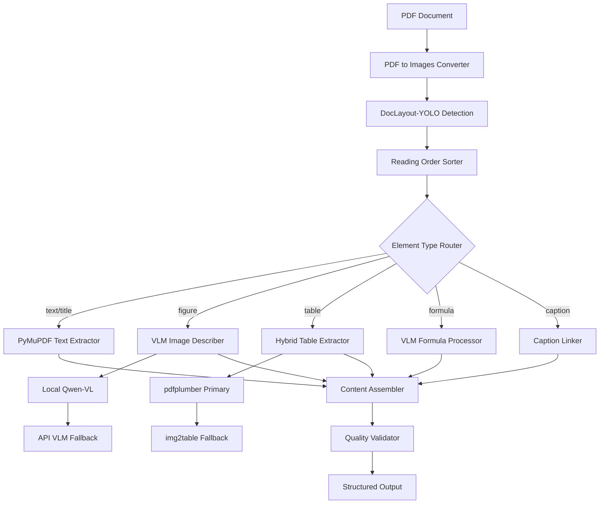

# Design Document

## Overview

The PDF Content Extraction Pipeline is a comprehensive system designed to process academic papers and research documents, extracting structured content in natural reading order while generating rich descriptions for visual elements. The system employs a hybrid approach combining multiple extraction methods to maximize accuracy and efficiency.

## Architecture



## Components and Interfaces

### Core Components

#### 1. PDFExtractor (Main Orchestrator)
```python
class PDFExtractor:
    def __init__(self, config: ExtractionConfig)
    def process_document(self, pdf_path: str) -> DocumentContent
    def process_page(self, page_num: int) -> PageContent
```

#### 2. LayoutDetector
```python
class LayoutDetector:
    def __init__(self, model_path: str, confidence_threshold: float = 0.25)
    def detect_elements(self, image: np.ndarray) -> List[DetectedElement]
```

#### 3. ReadingOrderSorter
```python
class ReadingOrderSorter:
    def sort_elements(self, elements: List[DetectedElement], page_width: int) -> List[DetectedElement]
    def handle_multi_column(self, elements: List[DetectedElement]) -> List[DetectedElement]
```

#### 4. ElementProcessors

**TextExtractor**
```python
class TextExtractor:
    def extract_text(self, page: fitz.Page, bbox: BoundingBox) -> str
    def preserve_formatting(self, text: str) -> str
```

**VLMDescriber**
```python
class VLMDescriber:
    def __init__(self, primary_vlm: VLMProvider, fallback_vlm: VLMProvider)
    def describe_image(self, image_crop: np.ndarray, caption: str = None) -> str
    def process_formula(self, formula_image: np.ndarray) -> FormulaResult
```

**TableExtractor**
```python
class TableExtractor:
    def __init__(self, primary_method: str = "pdfplumber")
    def extract_table(self, page: fitz.Page, bbox: BoundingBox) -> TableData
    def fallback_extraction(self, image_crop: np.ndarray) -> TableData
```

### Data Models

#### Core Data Structures
```python
@dataclass
class BoundingBox:
    x1: float
    y1: float
    x2: float
    y2: float

@dataclass
class DetectedElement:
    element_type: ElementType
    bbox: BoundingBox
    confidence: float
    sequence_order: int
    page_number: int

@dataclass
class PageElement:
    element_id: str
    element_type: ElementType
    content: str
    bbox: BoundingBox
    metadata: Dict[str, Any]
    parent_id: Optional[str] = None
    children_ids: List[str] = field(default_factory=list)

@dataclass
class TableData:
    headers: List[str]
    rows: List[List[str]]
    markdown: str
    json_repr: Dict[str, Any]
    summary: str
    extraction_method: str

@dataclass
class FormulaResult:
    latex: str
    text_representation: str
    image_path: str
    confidence: float

@dataclass
class PageContent:
    page_number: int
    elements: List[PageElement]
    extraction_stats: Dict[str, Any]
    quality_score: float

@dataclass
class DocumentContent:
    pages: List[PageContent]
    metadata: Dict[str, Any]
    extraction_summary: Dict[str, Any]
```

## Correctness Properties

*A property is a characteristic or behavior that should hold true across all valid executions of a system-essentially, a formal statement about what the system should do. Properties serve as the bridge between human-readable specifications and machine-verifiable correctness guarantees.*

### Property-Based Testing Integration

The system will be validated using property-based testing to ensure correctness across diverse inputs and edge cases. Each property represents a universal truth that must hold for all valid document processing scenarios.

### Core Properties

**Property 1: Element Detection Completeness**
*For any* PDF page processed by the system, the total number of detected elements should be greater than zero when the page contains visible content, and the sum of element areas should not exceed the page area.
**Validates: Requirements 1.1, 1.2**

**Property 2: Reading Order Consistency**
*For any* set of detected elements on a page, elements sorted in reading order should maintain monotonic progression in vertical position within columns, and left column elements should precede right column elements at the same vertical level.
**Validates: Requirements 2.1, 2.2**

**Property 3: Text Extraction Preservation**
*For any* text element extracted from a PDF, the extracted text length should be proportional to the bounding box area, and no text should be lost during coordinate transformation between image and PDF coordinate systems.
**Validates: Requirements 3.1, 3.2**

**Property 4: Caption-Parent Association**
*For any* caption element detected near a figure, table, or formula, the caption should be linked to exactly one parent element, and the parent should be spatially adjacent (within reasonable distance threshold).
**Validates: Requirements 2.3, 5.6**

**Property 5: Table Structure Integrity**
*For any* table extracted using either pdfplumber or img2table, the number of columns should be consistent across all rows, and the total cell count should equal rows × columns.
**Validates: Requirements 5.1, 5.2**

**Property 6: VLM Description Quality**
*For any* figure processed by the VLM, the generated description should contain at least 10 words and should include the figure type classification when the figure contains recognizable chart or diagram elements.
**Validates: Requirements 4.1, 4.3**

**Property 7: Formula Processing Round-trip**
*For any* mathematical formula processed by the VLM, if the LaTeX output is valid, rendering and re-processing the rendered image should produce semantically equivalent LaTeX (allowing for notation variations).
**Validates: Requirements 6.1, 6.2**

**Property 8: Parallel Processing Consistency**
*For any* document processed both sequentially and in parallel, the final extracted content should be identical regardless of processing method, with elements in the same reading order.
**Validates: Requirements 8.1, 8.4**

**Property 9: Error Recovery Completeness**
*For any* page where individual element extraction fails, the system should continue processing remaining elements, and the final output should contain all successfully processed elements with error flags for failed ones.
**Validates: Requirements 7.1, 7.2**

**Property 10: Output Format Consistency**
*For any* document processed by the system, converting the JSON output to other formats (Markdown, plain text) and back should preserve all essential content and structural relationships.
**Validates: Requirements 9.1, 9.2**

## Error Handling

### Graceful Degradation Strategy

1. **Element Detection Failures**: Continue processing other elements, log failures
2. **VLM Service Unavailability**: Fallback to alternative VLM or placeholder descriptions
3. **Table Extraction Failures**: Attempt fallback method, provide raw text if both fail
4. **Reading Order Ambiguity**: Use confidence scoring and spatial heuristics
5. **Memory/Resource Constraints**: Process pages individually, implement backpressure

### Error Recovery Mechanisms

- **Retry Logic**: Exponential backoff for transient failures
- **Fallback Chains**: Multiple extraction methods for each element type
- **Partial Results**: Return successfully processed content even if some elements fail
- **Quality Scoring**: Confidence metrics for extraction reliability

## Testing Strategy

### Dual Testing Approach

The system employs both unit testing and property-based testing for comprehensive validation:

**Unit Tests:**
- Specific test cases for known document layouts
- Edge cases like empty pages, corrupted PDFs
- Integration points between components
- Error condition handling

**Property-Based Tests:**
- Universal properties across diverse document types
- Randomized input generation for robustness testing
- Minimum 100 iterations per property test
- Each test tagged with: **Feature: pdf-content-extraction, Property {number}: {property_text}**

### Testing Framework

The system uses **Hypothesis** for property-based testing in Python, with custom generators for:
- PDF document structures
- Bounding box coordinates
- Element type distributions
- Multi-column layouts

### Performance Testing

- **Throughput**: Pages processed per minute
- **Latency**: Time per page for different document types
- **Resource Usage**: Memory and CPU utilization patterns
- **Scalability**: Performance under concurrent processing loads