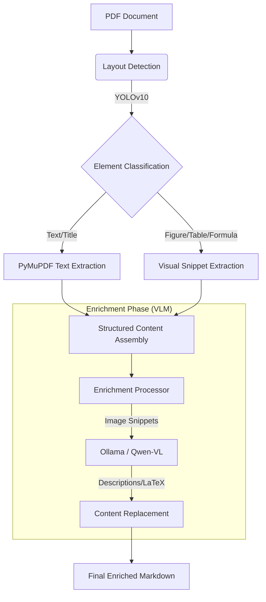

# DDC: PDF Content Extraction Pipeline

**DDC** is a sophisticated document processing pipeline designed to transform complex PDF documents—specifically academic papers and research articles—into high-quality, structured, and RAG-ready Markdown.

Unlike traditional PDF extractors that produce "text soup," DDC employs a hybrid approach combining **Computer Vision (YOLO)** for layout analysis, **PyMuPDF** for precise text extraction, and **Vision Language Models (VLMs)** to semantically understand and enrich tables, formulas, and figures.

## 🚀 Key Features

*   **Intelligent Layout Analysis**: Uses `DocLayout-YOLO` to detect and classify 10+ element types (Text, Title, Figure, Table, Formula, etc.) with high precision.
*   **Natural Reading Order**: Algorithms specifically designed to handle multi-column academic layouts, ensuring text flows logically.
*   **VLM Enrichment**: Automatically "sees" and describes visual elements:
    *   **Figures**: Generates descriptive captions using multimodal LLMs (e.g., Qwen-VL).
    *   **Tables**: Converts image-based tables into clean Markdown/CSV formats.
    *   **Formulas**: Transcribes mathematical equations into LaTeX.
*   **RAG-Optimized Output**: Produces structured Markdown where every element is tagged, ordered, and rich in semantic context, making it ideal for vector databases and LLM context windows.
*   **ZenML Orchestration**: Built on ZenML for reproducible, trackable, and scalable data processing pipelines.

## 🏗️ Architecture

The pipeline processes documents in two main stages: **Extraction** and **Enrichment**.



## 🛠️ Tech Stack

*   **Core Logic**: Python 3.12+
*   **Orchestration**: [ZenML](https://zenml.io/)
*   **Layout Model**: [DocLayout-YOLO](https://github.com/CPP-Review/DocLayout-YOLO) (Ultralytics)
*   **PDF Processing**: `PyMuPDF` (fitz), `pdf2image`
*   **OCR & VLM**: `LangChain`, `Ollama` (supporting Qwen2/3-VL)
*   **Package Management**: `uv`
*   **Task Runner**: `poethepoet`

## 📋 Prerequisites

Before running the pipeline, ensure you have the following installed:

1.  **Python 3.12+**
2.  **uv** (Fast Python package installer):
    ```bash
    curl -LsSf https://astral.sh/uv/install.sh | sh
    ```
3.  **Ollama**: Required for local VLM processing.
    *   Install Ollama from [ollama.com](https://ollama.com).
    *   Pull the required VLM model (refer to `data_ingestion2/pdf_parse/ocr_process.py` for the configured model name, e.g., `qwen2-vl`):
        ```bash
        ollama pull qwen2.5-vl 
        ```
    *(Note: Ensure the model name in `ocr_process.py` matches your local Ollama model)*

## 📦 Installation

1.  **Clone the repository:**
    ```bash
    git clone <repository-url>
    cd DDC
    ```

2.  **Install dependencies using `uv`:**
    ```bash
    uv sync
    ```

3.  **Initialize ZenML:**
    ```bash
    uv run poe setup
    ```

## 🏃 Usage

This project uses `poethepoet` to manage tasks. All commands can be run via `uv run poe <task_name>`.

### 1. Run the Full Pipeline
Executes the ZenML pipeline to process PDFs, extract content, and run VLM enrichment.
```bash
uv run poe run_pipeline
```

### 2. Visualize Pipeline Runs
Launches the ZenML dashboard to inspect pipeline steps, artifacts, and logs.
```bash
uv run poe viz
```

### 3. Run Standalone PDF Ingestion
Runs the layout analysis and extraction script directly (bypassing the full ZenML pipeline for debugging).
```bash
uv run poe pdf_ingestion
```

## 📂 Project Structure

```text
DDC/
├── data_ingestion2/         # Core extraction logic
│   ├── enrich_markdown.py   # VLM enrichment script
│   ├── pdf_parse/           # PDF processing modules
│   │   ├── doclayout.py     # YOLOv10 layout detection
│   │   ├── ocr_process.py   # LangChain/Ollama interface
│   │   └── utils.py         # Geometry and formatting utils
│   └── prompts/             # VLM prompts for specific elements
├── zenml_flow/              # ZenML pipeline definitions
│   ├── run_pipeline.py      # Pipeline entry point
│   ├── pipeline/            # Pipeline structure
│   └── steps/               # Individual pipeline steps
├── kb/                      # Knowledge Base (Input PDFs & Output)
│   └── snippets/            # Extracted images (tables, figures)
└── pyproject.toml           # Project configuration & dependencies
```

## 🔧 Configuration

*   **Model Weights**: The `DocLayout-YOLO` model is automatically downloaded from HuggingFace (`juliozhao/DocLayout-YOLO-DocStructBench`) on the first run.
*   **VLM Model**: Configured in `data_ingestion2/pdf_parse/ocr_process.py`. Default is set to a Qwen-VL variant. Change `self.model_name` if you wish to use a different model via Ollama.
*   **Prompts**: Custom prompts for tables, figures, and formulas can be modified in `data_ingestion2/prompts/`.
