# Agent0: Unleashing Self-Evolving Agents from Zero Data
via Tool-Integrated Reasoning

Peng Xia 1 Kaide Zeng 1 Jiaqi Liu 1 Can Qin 2 Fang Wu 3 Yiyang Zhou 1 Caiming Xiong 2 Huaxiu Yao 1

## Abstract

Large Language Model (LLM) Agents, often
trained with Reinforcement Learning (RL), are
constrained by a dependency on human-curated
data, limiting scalability and tethering AI to
human knowledge.
Existing self-evolution
frameworks offer an alternative but are typically
restricted by the model’s inherent capabilities and
single-round interactions, hindering the devel-
opment of complex curricula involving tool use
or dynamic reasoning. We introduce Agent0,
a fully autonomous framework that evolves
high-performing agents without external data
through multi-step co-evolution and seamless
tool integration. Agent0 establishes a symbiotic
competition between two agents initialized from
the same base LLM: a curriculum agent that pro-
poses increasingly challenging frontier tasks, and
an executor agent that learns to solve them. We
integrate external tools to enhance the executor’s
problem-solving capacity; this improvement, in
turn, pressures the curriculum agent to construct
more complex, tool-aware tasks.
Through
this iterative process, Agent0 establishes a
self-reinforcing cycle that continuously produces
high-quality curricula.
Empirically, Agent0
substantially
boosts
reasoning
capabilities,
improving the Qwen3-8B-Base model by 18%
on mathematical reasoning and 24% on general
reasoning benchmarks.
Code is available at
https://github.com/aiming-lab/Agent0.

## 1. Introduction

Large Language Model (LLM) Agents have shown re-
markable capabilities in tackling complex, long-horizon
problems (Qiu et al., 2025b;a; Jin et al., 2025; Yu et al.,
2025a; Tang et al., 2025; Zhai et al., 2025) that require

extensive interaction with an environment, such as deep
research (OpenAI, 2025; Google, 2024; Team et al., 2025)
and agentic coding (Jimenez et al., 2023; Anthropic, 2025;
Wang et al., 2024a). To optimize these complex, multi-
step interactions and move beyond hard-coded workflows,
Reinforcement Learning (RL) has emerged as a principal
training paradigm (Ouyang et al., 2022; Shao et al., 2024;
Tu et al., 2025), achieving significant progress on com-
plex reasoning tasks. However, the efficacy of these meth-
ods, whether Reinforcement Learning from Human Feed-
back (RLHF) or Reinforcement Learning from Verifiable
Rewards (RLVR), relies heavily on massive, high-quality,
human-curated datasets (Zhang et al., 2025c). This depen-
dency not only creates a severe scalability bottleneck (Yue
et al., 2025), which is time-consuming, labor-intensive, and
costly, but also fundamentally tethers the potential of AI to
the limits of human knowledge and annotation speed.

To break free from this reliance on human data, self-
evolution frameworks have emerged as a promising alterna-
tive (Zhao et al., 2025; Liu et al., 2025a; Huang et al., 2025;
Wang et al., 2025d), offering a scalable pathway by en-
abling models to autonomously generate their own training
data. Yet, despite their potential, existing self-play or self-
challenging approaches face severe constraints. First, their
capabilities are capped by the model’s inherent knowledge
and reasoning abilities (Fang et al., 2025; Cheng et al., 2024;
Zhou et al., 2025a), causing the generated tasks to rarely
surpass the model’s current complexity (Zhou et al., 2025b),
leading to learning stagnation. Second, these frameworks
typically operate only in single-round interactions (Li et al.,
2025c), failing to capture the dynamic, context-dependent
nature of real-world problems. This dual limitation not only
restricts the complexity of the self-generated curriculum but,
more critically, hinders the model from mastering essential
skills that require complex tool use or multi-step reasoning.

To address these challenges, as demostrated in Figure 1,
we introduce Agent0, a fully autonomous framework de-
signed to guide the evolution of agents entirely from scratch.
Agent0 completely eliminates the dependence on any ex-
ternal data or human annotations, pioneeringly combining
tool integration with multi-round co-evolution. The frame-
work’s implementation begins with a base LLM from which

### VLM Enrichment (figure)
1. **Title/Caption**:  
Figure (a) and (b): “Curriculum Agent and Executor Agent Framework with Performance Benchmarks on MATH, SuperGPQA, MMLU-Pro, and BBEH”

2. **Type**:  
Composite diagram combining an Architectural Diagram (Figure a) and four Bar Charts (Figure b).

3. **Data Points/Labels**:  
- **Figure (a) Components**:  
  - Agents: Curriculum Agent (bear character), Executor Agent (owl character).  
  - Flow: Question (q) → Executor Agent → Tool → Reasoning Process → Predicted Answer (â) → Rewards (rC, rE).  
  - Reasoning Process Subcomponents: Model Response (blue), Tool Calling (green), Tool Response (orange), Environment (globe icon).  
  - Reward Symbols: Blue gift box (rC), green gift box (rE).  
- **Figure (b) Bar Charts**:  
  - **MATH**: Qwen3-8B (78.0), w/ tools (79.2), Agent0 (82.4)  
  - **SuperGPQA**: Qwen3-8B (28.3), w/ tools (29.4), Agent0 (33.0)  
  - **MMLU-Pro**: Qwen3-8B (51.8), w/ tools (54.8), Agent0 (63.4)  
  - **BBEH**: Qwen3-8B (8.6), w/ tools (9.4), Agent0 (13.7)  
  - Axes: Y-axis labeled with score values; X-axis labeled with model variants.

4. **Detailed Summary**:  
Figure (a) illustrates a multi-agent reinforcement learning architecture for question-answering. The Curriculum Agent generates a question (q) and receives a Curriculum Reward (rC) based on the predicted answer (â). The Executor Agent processes the question, invokes external tools via Tool Calling, interacts with an Environment (simulated via globe icon), and generates a Tool Response. The Reasoning Process integrates Model Response, Tool Calling, and Tool Response to produce â. Executor Reward (rE) is computed based on â’s accuracy. Arrows denote directional data flow: q → Executor Agent → Tool → Reasoning Process → â → rC and rE.  
Figure (b) presents comparative performance metrics across four benchmarks: MATH, SuperGPQA, MMLU-Pro, and BBEH. Each chart compares three configurations: base Qwen3-8B, Qwen3-8B with tools, and Agent0. Agent0 consistently outperforms both baselines across all benchmarks, with statistically significant score increases (e.g., +4.4 on MATH, +3.6 on SuperGPQA, +8.6 on MMLU-Pro, +4.3 on BBEH). The bar charts use distinct colors: gray for Qwen3-8B, dark gray for w/ tools, and blue for Agent0.

5. **Key Takeaway**:  
Agent0, a curriculum-driven multi-agent system integrating tool-augmented reasoning and dual reward signals, achieves state-of-the-art performance across four diverse reasoning benchmarks compared to base and tool-enhanced Qwen3-8B models.

--
*(Original Snippet: 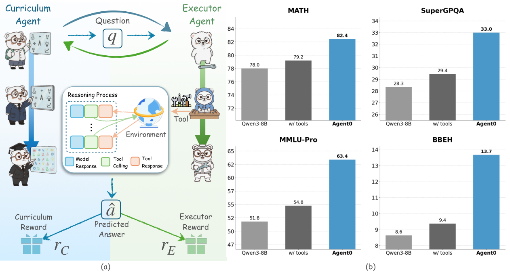)*

**Figure_Caption:** Figure 1. The Agent0 autonomous co-evolution framework. The Curriculum Agent (left) uses RL to generate frontier tasks, rewarded
by the Executor Agent’s uncertainty and tool-use frequency. The Executor Agent (right) learn to solve them by RL. This shared tool
integration drives a virtuous cycle, spiraling up task complexity and agent capability entirely from scratch.

we initialize two functionally distinct agents: an execu-
tor agent and a curriculum agent. These agents co-evolve
through a symbiotic competition: the curriculum agent is
trained using RL (Shao et al., 2024) to propose frontier
tasks that precisely challenge the executor’s current capabil-
ities, using the executor’s uncertainty (i.e., self-consistency
across multiple answers) and its frequency of tool use as
reward signals. Concurrently, the executor agent is trained
via RL to successfully solve these tasks, optimizing on a
filtered set of challenging problems generated by the frozen
curriculum agent and using pseudo-labels derived from its
own majority voting. Equipping the executor with a tool
enhances its problem-solving abilities, which in turn com-
pels the tool-equipped curriculum agent to generate more
complex, tool-based curricula. This establishes a virtuous
cycle, driving a synchronous spiral of improvement in both
agent capability and curriculum complexity. Furthermore,
we extend this paradigm to support multi-turn interactions,
enabling the generation of context-rich, conversational tasks
that better reflect real-world problem-solving.

The primary contribution of this paper is Agent0, a novel
framework that autonomously evolves LLM agents from
scratch through tool-augmented reasoning without relying
on any external data. Across ten benchmarks spanning
mathematical and general reasoning, empirical results show
that Agent0 achieves substantial model agnostic capabil-
ity gains, improving mathematical reasoning performance
by 18% and general reasoning performance by 24%. In
addition, our analysis confirms this gain is driven by our
co-evolutionary loop, where the curriculum agent learns to
generate progressively complex tasks, creating a virtuous

cycle of the executor’s capability improvement.

## 2. Preliminaries

LLM as a Policy Agent. We formulate the LLM as an
agent, represented by a policy πθ with parameters θ. Given
a prompt x, the agent autoregressively generates a response
y ∼πθ(·|x).
The general objective of reinforcement
learning is to optimize θ to maximize the expected reward
J(θ) = Ex∼D,y∼πθ(·|x)[R(y|x)].

Group
Relative
Policy
Optimization
(GRPO).
GRPO (Shao et al., 2024) is a reinforcement learn-
ing method that avoids training a critic by using intra-group
relative rewards. For each prompt x, the model samples G
responses {y1, . . . , yG}, which are scored to get rewards
{r1, . . . , rG}. GRPO computes normalized advantages ˆAi
using a z-score:
ˆAi =
ri−mean({rj}G
j=1)
std({rj}G
j=1)+ϵnorm , where ϵnorm is a
small constant for numerical stability. The policy is then
updated by minimizing the following PPO-style clipped
loss function (Schulman et al., 2017):

**Formula_Caption:** (1)

### VLM Enrichment (isolate_formula)
$$ \mathcal{L}_{\text{GRPO}}(\theta) = -\frac{1}{G} \sum_{i=1}^{G} \min \left( \frac{\pi_{\theta}(x_i)}{\pi_{\theta_{\text{old}}}(x_i)} \hat{A}_i, \right. \\ \left. \text{clip} \left( \frac{\pi_{\theta}(x_i)}{\pi_{\theta_{\text{old}}}(x_i)}, 1 - \epsilon, 1 + \epsilon \right) \hat{A}_i \right) + \beta \text{KL}(\pi_{\theta} \| \pi_{\theta_{\text{old}}}), $$

--
*(Original Snippet: 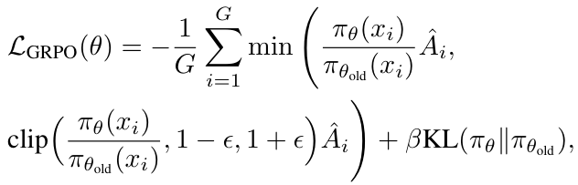)*

where
πθ(xi)
πθold(xi) is the importance sampling ratio between
the current policy πθ and the reference policy πθold from the
previous iteration. ˆAi is the normalized advantage, and ϵ
and β are hyperparameters. The KL-divergence term acts

### VLM Enrichment (figure)
Error during async OCR enrichment: too many concurrent requests (status code: 429)

--
*(Original Snippet: 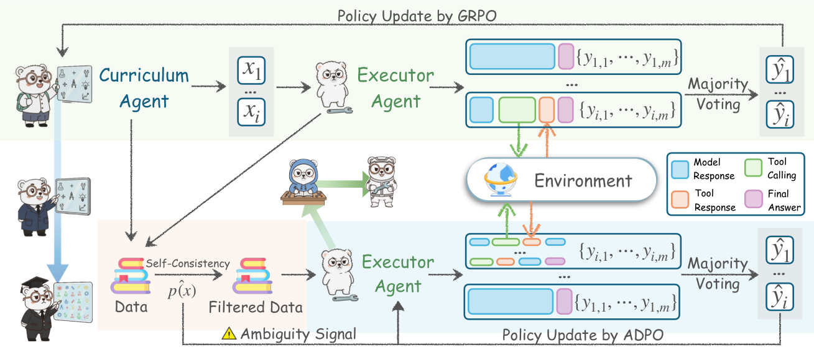)*

**Figure_Caption:** Figure 2. The Agent0 co-evolutionary loop. (1) Curriculum Evolution: The Curriculum Agent πθ is trained via RL to generate tasks,
maximizing a reward RC based on executor Uncertainty Runc, Tool Use Rtool and Repetition Penalty Rrep. (2) Executor Evolution: Tasks
are filtered by self-consistency score ˆp to create a challenging dataset D(t). The Executor Agent πϕ is then trained on D(t) via ADPO, an
ambiguity-aware RL method using majority-vote pseudo-labels ˜y.

as a regularization penalty to stabilize training.

## 3. The Agent0 Framework

## 3.1. Framework Overview

Agent0 is a fully autonomous, iterative co-evolutionary
framework designed to enhance the capabilities of LLM
agents without relying on any human-annotated data. At
the core of this framework are two functionally distinct
agents initialized from the same base LLM, πbase: (1) Cur-
riculum Agent (πθ) aims to generate frontier tasks that are
appropriately challenging for the current Executor Agent;
(2) Executor Agent (πϕ) aims to solve the increasingly
complex tasks proposed by the Curriculum Agent.

These two agents co-evolve iteratively through a process
of symbiotic competition, as illustrated in Figure 2. Each
iteration t of this process is divided into two stages:

Curriculum Evolution. We train the Curriculum Agent πθ
using RL to specialize in generating tasks that challenge the
current Executor Agent π(t−1)
ϕ
.

Executor Evolution. We use the frozen Curriculum Agent
π(t)
θ
to generate a pool of tasks, from which we filter a
challenging dataset D(t). We then train the Executor Agent
πϕ on this dataset using RL, evolving it into π(t)
ϕ .

The integration of a code interpreter tool establishes a virtu-
ous cycle: the Executor Agent’s problem-solving capabil-
ities are enhanced by the tool, which in turn compels the
tool-equipped Curriculum Agent to generate more complex,
tool-based curricula. Furthermore, the framework supports

multi-turn interactions, enabling the Curriculum Agent to
generate context-rich, conversational tasks that better reflect
real-world problem-solving.

## 3.2. Curriculum Agent Training

The goal of the Curriculum Agent πθ, is to generate a prompt
x that maximizes a composite reward signal RC. This re-
ward signal is designed to quantify the challenge of task x
for the current Executor Agent πϕ. We optimize πθ using
the GRPO algorithm described in the Section 2.

For each task xi generated by πθ, we compute its reward by
sampling k responses {yj}k
j=1 from the current Executor πϕ.
The composite reward RC consists of two key components:

Uncertainty Reward. This reward incentivizes the Cur-
riculum Agent to generate tasks that the Executor finds
confusing or uncertain (Shi et al., 2025; Bae et al., 2025).
We use the Executor’s self-consistency ˆp(x; πϕ) as a proxy
for uncertainty. ˆp is defined as the proportion of the k re-
sponses that vote for the majority answer (˜y). The reward
function is designed to be maximized when ˆp = 0.5, where
the Executor’s uncertainty is highest:

### VLM Enrichment (isolate_formula)
Error during async OCR enrichment: too many concurrent requests (status code: 429)

--
*(Original Snippet: 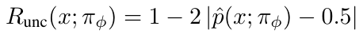)*

**Formula_Caption:** (2)

This function penalizes tasks that are either too easy (ˆp →1)
or too hard (ˆp →0).

Tool Use Reward. To drive the virtuous cycle, we must ex-
plicitly reward tasks that prompt the Executor to use its tool.
We define Rtool based on the number of tool invocations,
identified by the tool response marker, i.e., ‘‘‘output,
within a complete prediction y = πϕ(x). Let Ntool(y) be

### VLM Enrichment (table)
| Algorithm 1 Self-Evolutionary Framework Agent0 |
| --- |
| Require: Base LLM πbase; Iterations T; Samples k. |
| 1: Initialize πθ(0) ← πbase and πϕ(0) ← πbase. |
| 2: for each iteration t = 1, . . . , T do |
| 3: ▷ Curriculum Evolution (Train πθ) |
| 4: Initialize πθ ← πθ(t−1) |
| 5: Generate a batch of tasks X = {xi} ∼ πθ |
| 6: for task xi ∈ X do |
| 7: Sample k responses {yj}j=1k ∼ πϕ(t−1)(xi) |
| 8: Compute RC(xi) using Eq. 5 |
| 9: end for |
| 10: Update πθ using LGRPO with (X, RC) → πθ(t) |
| 11: ▷ Executor Evolution (Train πϕ) |
| 12: Generate Xpool ∼ πθ(t) and filter to D(t) = {(x, p̂, ỹ)} where |p̂(x) − 0.5| ≤ δ |
| 13: Initialize πϕ ← πϕ(t−1) |
| 14: for batch BD = {(x, p̂(x), ỹ)} ∼ D(t) do |
| 15: Initialize Tbatch, Ãbatch, Pbatch |
| 16: for (x, p̂(x), ỹ) ∈ BD do |
| 17: Sample k trajectories {τi}i=1k ∼ πϕ(x) |
| 18: Compute rewards Ri = I(oi = ỹ) |
| 19: Compute scaled advantages Ãi ← Ai · f(p̂(x)) |
| 20: Add {τi} to Tbatch, {Ãi} to Ãbatch, p̂(x) to Pbatch |
| 21: end for |
| 22: Update πϕ using LADPO (Eq. 8) on collected batch |
| 23: end for |
| 24: πϕ(t) ← πϕ |
| 25: end for |

--
*(Original Snippet: 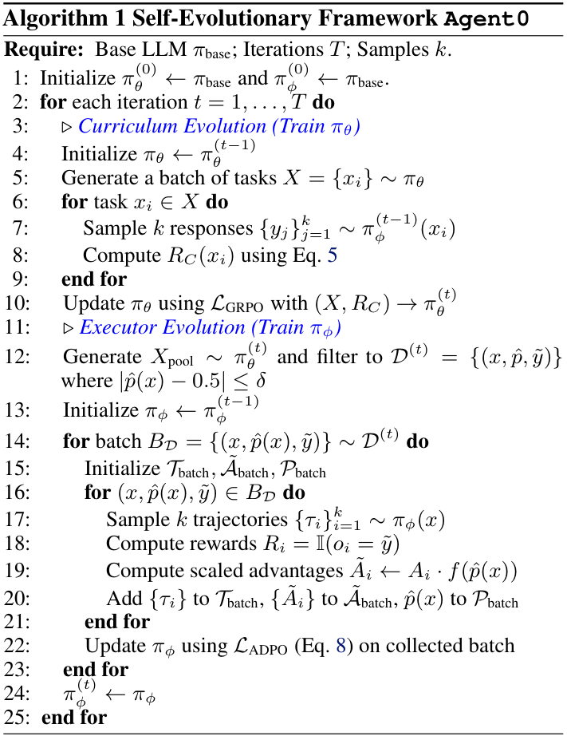)*

the total count of these markers in y. The reward is then
calculated as a weighted, capped value:

### VLM Enrichment (isolate_formula)
Error during async OCR enrichment: too many concurrent requests (status code: 429)

--
*(Original Snippet: 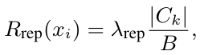)*

**Formula_Caption:** (3)

where γ is a scaling hyperparameter for reward score and C
is a cap on the number of rewarded calls to prevent reward-
ing excessive or spurious tool use.

Repetition Penalty. To encourage diversity within a train-
ing batch X, following (Huang et al., 2025), we intro-
duce a repetition penalty Rrep.
We first compute pair-
wise distances between generated tasks using a similar-
ity metric, such as BLEU score (Papineni et al., 2002):
dij = 1 −BLEU(xi, xj). Tasks are then grouped into clus-
ters C = {C1, ..., CK} where dij < τBLEU. The penalty
for a task xi belonging to cluster Ck is proportional to its
relative cluster size:

### VLM Enrichment (isolate_formula)
Error during async OCR enrichment: too many concurrent requests (status code: 429)

--
*(Original Snippet: 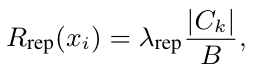)*

**Formula_Caption:** (4)

where B is the batch size and λrep is a scaling factor.

Composite Reward. The final reward combines these sig-
nals, subtracting the repetition penalty, and is gated by a
format check Rformat.

### VLM Enrichment (isolate_formula)
Error during async OCR enrichment: too many concurrent requests (status code: 429)

--
*(Original Snippet: 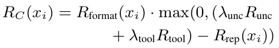)*

**Formula_Caption:** (5)

where λunc, λtool, and λrep are hyperparameters. We use this
RC as the reward ri in the GRPO loss.

## 3.3. Executor Agent Training

The Executor Agent πϕ’s objective is to maximize its suc-
cess rate in solving tasks generated by the Curriculum Agent
πθ. This stage of training is also based on GRPO.

## 3.3.1. DATASET CURATION AND TRAJECTORY
GENERATION

Challenging Dataset Construction. After the Curriculum
Agent π(t)
θ
is trained, we freeze it. We use it to generate
a large pool of candidate tasks Xpool. For each task x in
this pool, we have the current Executor π(t−1)
ϕ
sample k
responses and calculate its self-consistency ˆp(x). It is cal-
culated as the proportion of responses that voted for this
majority answer ˜y:

### VLM Enrichment (isolate_formula)
Error during async OCR enrichment: too many concurrent requests (status code: 429)

--
*(Original Snippet: 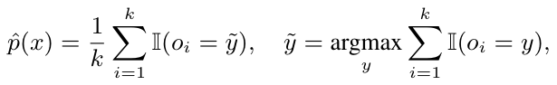)*

**Formula_Caption:** (6)

where I is the indicator function. To build an efficient
training curriculum, we filter for tasks that lie at the ca-
pability frontier. So we retain only those tasks whose self-
consistency scores fall within an informative band:

### VLM Enrichment (isolate_formula)
Error during async OCR enrichment: too many concurrent requests (status code: 429)

--
*(Original Snippet: 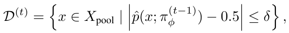)*

**Formula_Caption:** (7)

where δ is a threshold controlling the curriculum difficulty.
This filtering step ensures that πϕ trains only on tasks that
are neither too easy nor too hard for it.

Multi-Turn Rollout. We replace the standard single-turn
generation with a multi-step, tool-integrated rollout pro-
cess. During this process, each of the k trajectories is
generated by having the policy π(t−1)
ϕ
first produce text
reasoning t1. When the policy emits a tool-call trigger (i.e.,
‘‘‘python...‘‘‘ tags), generation is paused. The code
c1 is then executed in a sandbox, which returns an execu-
tion result or error f1. This feedback f1, prepended with a
simple prefix like ‘‘‘output...‘‘‘, is fed back to the
policy. The policy then continues generating, conditioning
on the history and the new feedback [t1 ⊕c1 ⊕f1 ⊕...].
This iterative process repeats until the policy generates a
final answer o (i.e., in {boxed...} tags), resulting in a
complete, hybrid reasoning trajectory. This dynamic, inter-
leaved feedback mechanism allows the agent to iteratively
refine its reasoning and correct errors, mimicking the “aha
moment” of self-correction.

Pseudo-Label Advantage. After generating k full trajec-
tories and identifying their k final answers {oi}k
i=1, we use
the previously determined majority answer ˜y as the pseudo-
label. We then assign a terminal reward Ri = I(oi = ˜y) to

each trajectory based on whether its answer oi matches this
pseudo-label. This outcome reward Ri is used to compute
the advantage Ai for the entire multi-step trajectory i.

## 3.3.2. AMBIGUITY-DYNAMIC POLICY OPTIMIZATION

Standard GRPO treats all training samples equally (Schul-
man et al., 2017; Shao et al., 2024). However, in our self-
evolutionary setting, we rely on majority voting to derive
pseudo-labels, which introduces two critical issues: label
noise and restricted exploration on ambiguous tasks. To
address these, we propose Ambiguity-Dynamic Policy Op-
timization (ADPO), which incorporates two key modifica-
tions motivated by the data’s ambiguity signal ˆp(x).

Ambiguity-Aware Advantage Scaling. The first issue
is that for high-ambiguity tasks (low ˆp(x)), the majority
answer is prone to errors. Directly optimizing on these
noisy labels using standard GRPO risks reinforcing incor-
rect reasoning. To prevent overfitting to potentially inaccu-
rate pseudo-labels, we scale the normalized advantage ˆAi.
We define a scaling factor s(x) = f(ˆp(x)), where f is an
increasing function of self-consistency. The advantage is
modified as ˜Ai(x) = ˆAi · s(x). This proportionally down-
weights the training signal from unreliable, low-consistency
samples.

## Ambiguity-

### VLM Enrichment (figure)
Error during async OCR enrichment: too many concurrent requests (status code: 429)

--
*(Original Snippet: 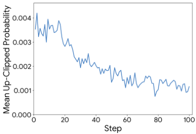)*

Modulated
Trust
Regions.
The sec-
ond
issue
pertains
to
the
rigid
con-
straints imposed by
standard
proximal
algorithms (Yu et al.,
2025b). While static
clipping (e.g., ϵ) is
designed to ensure
stability, it creates an
asymmetric
barrier

**Figure_Caption:** Figure 3. Up-clipped token probabil-
ities. Most up-clipped tokens have
low probabilities, implying standard
clipping limits exploration.

to learning. As illustrated in Figure 3, empirical analysis
reveals that the upper clipping bound is predominantly
triggered by tokens with low probabilities. This indicates
that the standard mechanism disproportionately “clamps”
the growth of unlikely tokens, effectively stifling the
emergence of new reasoning paths.
This restriction is
particularly detrimental for high-ambiguity tasks (low
ˆp(x)), where the correct reasoning often resides in the tail
of the current policy distribution and requires significant
updates to surface.
To address this bottleneck, ADPO
dynamically modulates the trust region. We define the
upper clipping bound ϵhigh(x) as a decreasing function of
ˆp(x). This effectively relaxes the constraint for ambiguous
inputs, permitting larger gradient steps to uplift potential
low-probability solutions, while retaining tight bounds on

confident samples to preserve stability.

The Executor Agent is updated by minimizing the ADPO
objective:

### VLM Enrichment (isolate_formula)
Error during async OCR enrichment: too many concurrent requests (status code: 429)

--
*(Original Snippet: 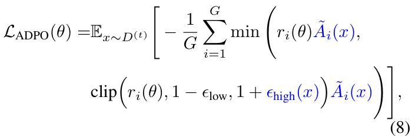)*

**Formula_Caption:** (8)

where ri(θ) is the importance sampling ratio, ˜Ai(x) is the
ambiguity-scaled advantage, and ϵhigh(x) is the dynamic
upper bound inversely related to ˆp(x).

## 4. Experiments

In this section, we evaluate the performance of Agent0,
aiming to answer the following questions: (1) How does
the performance of Agent0 compare against state-of-the-art
self-evolving baselines? (2) Is the proposed co-evolutionary
loop effective at progressively improving the agents’ perfor-
mance over multiple iterations? (3) How effective is each
key component of our framework? (4) Can the mathemat-
ical reasoning abilities cultivated by Agent0 generalize to
improve performance on general-domain reasoning tasks?

## 4.1. Experimental Setup

Implementation Details.
Our framework Agent0, is
implemented based on the VeRL (Sheng et al., 2025).
We evaluate Agent0 on two base models: Qwen3-4B-
Base and Qwen3-8B-Base (Yang et al., 2025a). Both the
two Agent are initialized from these base models. Dur-
ing the co-evolutionary loop, for each task xi, we sam-
ple k = 10 responses from the Executor to compute un-
certainty and generate pseudo-labels. The task filtering
threshold is set to δ = 0.25, retaining tasks with a self-
consistency ˆp(x) between 0.3 and 0.8. For the Curricu-
lum Agent, we set the tool reward scaling λtool = 0.6
and cap C = 4. For the Executor Agent, we integrate a
sandboxed code interpreter (Cheng et al., 2025) based on
VeRL-Tool (Jiang et al., 2025), allowing it to execute code
snippets enclosed in ‘‘‘python...‘‘‘ tags and receive
the ‘‘‘output...‘‘‘.

Baseline Methods. We compare Agent0 against several
state-of-the-art self-improvement methods. 1) Base Model:
The pre-trained base model without any fine-tuning. 2) Base
Model w/ tool: The base model evaluated in a zero-shot
setting, but given access to the code interpreter. 3) Self-
Evolving Methods: R-Zero (Huang et al., 2025), Absolute
Zero (Zhao et al., 2025), SPIRAL (Liu et al., 2025a) and
Socratic-Zero (Wang et al., 2025d).

Evaluation Datasets and Metrics. Agent0 requires no

Evaluation Datasets and Metrics. Agent0 requires no

**Table_Caption:** Table 1. Comprehensive results on mathematical reasoning benchmarks. The peak performance achieved during each model’s training
process is highlighted in bold.

### VLM Enrichment (table)
| Model Name | ✗ | 🌀 | AVG | AMC | Minerva | MATH | GSM8K | Olympiad | AIME25 | AIME24 |
| --- | --- | --- | --- | --- | --- | --- | --- | --- | --- | --- |
| *Qwen3-4B-Base* |  |  |  |  |  |  |  |  |  |  |
| Base Model | ✗ | ✗ | 42.6 | 45.7 | 38.2 | 68.2 | 87.8 | 41.0 | 6.15 | 10.9 |
| Base Model w/ tool | ✓ | ✗ | 44.2 | 46.3 | 39.6 | 71.0 | 88.6 | 43.7 | 7.71 | 12.3 |
| + Absolute Zero | ✓ | ✗ | 46.4 | 50.0 | 41.9 | 76.2 | 89.3 | 41.5 | 13.4 | 12.2 |
| + SPIRAL | ✗ | ✗ | 47.0 | 57.5 | 42.4 | 76.4 | 91.0 | 38.4 | 10.0 | 13.3 |
| + R-Zero | ✗ | ✗ | 49.1 | 57.3 | 52.9 | 79.6 | 92.1 | 44.6 | 4.27 | 12.7 |
| + Agent 0 | ✓ | ✗ | 52.5 | 60.6 | 55.6 | 80.5 | 92.6 | 46.7 | 14.1 | 17.4 |
| *Qwen3-8B-Base* |  |  |  |  |  |  |  |  |  |  |
| Base Model | ✗ | ✗ | 49.2 | 52.0 | 50.0 | 78.0 | 89.1 | 44.7 | 16.7 | 13.9 |
| Base Model w/ tool | ✓ | ✗ | 53.2 | 60.3 | 54.9 | 79.2 | 90.7 | 47.9 | 18.7 | 20.9 |
| + Absolute Zero | ✓ | ✗ | 52.6 | 62.5 | 52.9 | 76.6 | 92.0 | 47.8 | 18.2 | 18.4 |
| + R-Zero | ✗ | ✗ | 54.7 | 61.7 | 60.7 | 82.0 | 94.1 | 48.9 | 19.2 | 16.4 |
| + Socratic-Zero | ✗ | ✓ | 56.1 | 63.7 | 52.4 | 81.2 | 87.3 | 55.1 | 24.5 | 28.4 |
| + Agent 0 | ✓ | ✗ | 58.2 | 62.4 | 61.3 | 82.4 | 94.5 | 54.0 | 24.8 | 28.0 |

--
*(Original Snippet: 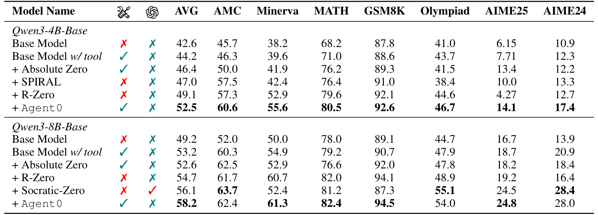)*

**Table_Caption:** Table 2. Results on general-domain reasoning benchmarks.

### VLM Enrichment (table)
| Model Name |  |  | Overall AVG | MATH AVG | SuperGPQA | MMLU-Pro | BBEH |
| --- | --- | --- | --- | --- | --- | --- | --- |
| *Qwen3-4B-Base* |  |  |  |  |  |  |  |
| Base Model | ✗ | ✗ | 27.1 | 42.6 | 20.9 | 37.4 | 7.57 |
| Base Model w/ tool | ✓ | ✗ | 30.3 | 44.2 | 25.8 | 42.9 | 8.32 |
| + Absolute Zero | ✓ | ✗ | 33.6 | 46.4 | 27.1 | 52.6 | 8.3 |
| + SPIRAL | ✗ | ✗ | 34.2 | 47.0 | 27.1 | 53.2 | 9.57 |
| + R-Zero | ✗ | ✗ | 34.6 | 49.1 | 27.6 | 51.5 | 10.4 |
| + Agent0 | ✓ | ✓ | 37.6 | 52.5 | 29.9 | 55.9 | 12.0 |
| *Qwen3-8B-Base* |  |  |  |  |  |  |  |
| Base Model | ✗ | ✗ | 34.5 | 49.2 | 28.3 | 51.8 | 8.6 |
| Base Model w/ tool | ✓ | ✗ | 36.7 | 53.2 | 29.5 | 54.8 | 9.37 |
| + Absolute Zero | ✓ | ✗ | 39.9 | 52.6 | 33.5 | 62.5 | 10.8 |
| + R-Zero | ✗ | ✗ | 38.7 | 54.7 | 31.4 | 58.2 | 10.6 |
| + Socratic-Zero | ✗ | ✓ | 39.2 | 56.1 | 30.1 | 60.9 | 9.5 |
| + Agent0 | ✓ | ✗ | 42.1 | 58.2 | 33.0 | 63.4 | 13.7 |

--
*(Original Snippet: 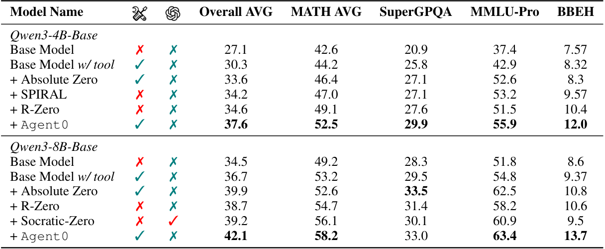)*

human-annotated data for training. We evaluate all methods
on two suites of benchmarks: 1) Mathematical Reason-
ing: We use a comprehensive set including AMC, Min-
erva (Lewkowycz et al., 2022), MATH (Hendrycks et al.,
2021), GSM8K (Cobbe et al., 2021), Olympiad-Bench (He
et al., 2024), AIME25, and AIME24. 2) General-Domain
Reasoning: To measure generalization, we use SuperG-
PQA (Du et al., 2025), MMLU-Pro (Wang et al., 2024b),
and BBEH (Kazemi et al., 2025). We report the accuracy
(pass@1) based on greedy decoding across all benchmarks,
except AMC and AIME benchmarks (mean@32).

## 4.2. Main Results

We present the main results for mathematical reasoning in
Table 1 and for general-domain reasoning in Table 2.

Comparison with Baselines. It significantly outperforms
all compared baseline methods in both mathematics and
general-domain reasoning. On Qwen3-8B-Base, Agent0
surpasses the powerful data-free method R-Zero by 6.4%
and outperforms the self-play method Absolute Zero, which

utilizes a code executor, by 10.6%. It even exceeds Socratic-
Zero by 3.7%, which relies on external OpenAI APIs. This
demonstrates the superiority of Agent0’s self-evolution ap-
proach. By using tools to interact with the environment,
the agent effectively enhances the quality and diversity of
questions generated by the curriculum agent. Similarly,
for the execution agent, this more effectively improves its
problem-solving capabilities.

Generalization to General-Domain Tasks. Furthermore,
Table 2 shows strong evidence of generalization. On Qwen3-
8B, Agent0 achieves the highest overall average score
among all approaches, significantly outperforming other
data-free methods. This indicates that the complex, multi-
step reasoning abilities we cultivated in the execution agent
by using the curriculum agent with tools, can be effectively
transferred to general-domain tasks.

## 4.3. Analysis

In this section, we provide a detailed analysis of each mod-
ule’s performance, along with a series of analytical experi-

### VLM Enrichment (figure)
1. **Title/Caption**:  
   Figure: Dual-panel bar chart titled “Math AVG” (left) and “General AVG” (right), comparing model performance across iterations.

2. **Type**:  
   Comparative Bar Chart (dual-panel, side-by-side).

3. **Data Points/Labels**:  
   - **Left Panel (“Math AVG”)**:  
     - Y-axis: “Accuracy” (range 50–60).  
     - X-axis: Iterations (“Iter1”, “Iter2”, “Iter3”).  
     - Legend: Green bar = “Qwen3-4B”, Blue bar = “Qwen3-8B”.  
     - Data:  
       - Iter1: Qwen3-4B ≈ 52.0, Qwen3-8B ≈ 55.2  
       - Iter2: Qwen3-4B ≈ 52.3, Qwen3-8B ≈ 55.7  
       - Iter3: Qwen3-4B ≈ 52.7, Qwen3-8B ≈ 58.2  
   - **Right Panel (“General AVG”)**:  
     - Y-axis: “Accuracy” (range 30–40).  
     - X-axis: Iterations (“Iter1”, “Iter2”, “Iter3”).  
     - Legend: Green bar = “Qwen3-4B”, Blue bar = “Qwen3-8B”.  
     - Data:  
       - Iter1: Qwen3-4B ≈ 31.5, Qwen3-8B ≈ 36.0  
       - Iter2: Qwen3-4B ≈ 32.0, Qwen3-8B ≈ 36.3  
       - Iter3: Qwen3-4B ≈ 32.7, Qwen3-8B ≈ 37.0  

4. **Detailed Summary**:  
   The figure presents a comparative performance analysis of two model variants — Qwen3-4B and Qwen3-8B — across three iterative training or evaluation cycles (Iter1, Iter2, Iter3) on two distinct benchmark categories: “Math AVG” and “General AVG”. In both panels, Qwen3-8B consistently outperforms Qwen3-4B in absolute accuracy. Both models exhibit a monotonic increase in accuracy across iterations, indicating progressive performance improvement. The performance gap between Qwen3-8B and Qwen3-4B widens in Iter3 for “Math AVG” (≈5.5-point delta) compared to “General AVG” (≈4.3-point delta), suggesting greater relative gain for the larger model on math-specific tasks. No error bars or statistical significance indicators are present. The dual-panel layout enables cross-domain comparison of model scaling effects.

5. **Key Takeaway**:  
   Qwen3-8B consistently achieves higher accuracy than Qwen3-4B across all iterations and both Math and General AVG benchmarks, with performance gains accelerating in later iterations, particularly in math tasks.

--
*(Original Snippet: 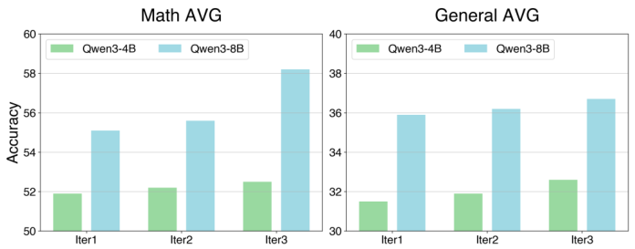)*

**Figure_Caption:** Figure 4. Performance on mathematical and general reasoning
benchmarks, showing consistent improvement for both Qwen3-4B
and Qwen3-8B across three co-evolutionary iterations.
ments, to better understand the performance gains.

**Table_Caption:** Table 3. Ablation study of Agent0.

### VLM Enrichment (table)
|Method|General AVG|Math AVG|
|---|---|---|
|Agent0|36.7|58.2|
|Curriculum Agent|||
|w/o Training|29.5|46.8|
|w/o Tool Reward|31.8|48.7|
|w/o Repetition Penalty|31.3|47.9|
|Execution Agent|||
|w/o ADPO|34.9|56.2|
|w/o Multi-turn|35.3|55.9|

--
*(Original Snippet: 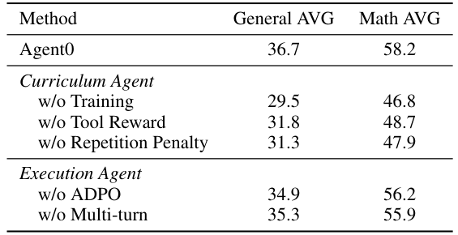)*

Ablation Study. As shown in Table 3, we conducted a
series of ablation experiments to evaluate the impact of each
component in our method. Specifically, we evaluate the
impact of: (1) the curriculum agent’s training, (2) the tool
reward, (3) the repetition penalty, (4) our ambiguity scal-
ing mechanism, and (5) the multi-turn reasoning capability.
For the curriculum agent, without training, the performance
significantly drops by 9.3%. This reflects the value of the
learned curriculum. Next, when the tool reward is not in-
cluded, the model’s performance drops by 7.2%. This tests
our core hypothesis that explicitly rewarding tool-use tasks
is necessary. It shows a severe performance degradation
when we remove the diversity component, indicating that
Rrep is highly effective for curriculum diversity, particularly
for general tasks. As for the execution agent, training it us-
ing the original GRPO with standard advantage and clipping
resulted in a performance drop of 1.9%. This is because
the original algorithm does not account for the reliability of
pseudo-labels, demonstrating the effectiveness of our pro-
posed ambiguity scaling mechanism. The introduction of
multi-turn reasoning played a significant role in boosting
Agent0’s performance, especially for complex mathematical
reasoning that requires multi-turn reasoning.

Consistent Improvement through Co-Evolution.
As
shown in Figure 4, our method demonstrates stable and
progressive improvement during the iterative process. On
Qwen3-8B-Base, the average math score improved from
55.1 (Iter 1) to 56.5 (Iter 2), peaking at 58.2 (Iter 3). In
addition to mathematics, Agent0 showed the similar trend
on other general-domain reasoning tasks, with an average
improvement of 2% per iteration compared to the previous
one. This iterative gain validates the effectiveness of our

**Table_Caption:** Table 5. Evolution of Task Difficulty and Tool Use. We report
the pass rate of the fixed Execution Agent (from Iteration 1) on
datasets generated by the Curriculum Agent at different stages.

### VLM Enrichment (table)
Error during async OCR enrichment: too many concurrent requests (status code: 429)

--
*(Original Snippet: )*

co-evolutionary loop. With the involvement of tools, the cur-
riculum agent progressively generates more difficult tasks,
while the execution agent learns to solve these tasks more
efficiently. This also confirms that agent self-evolution is a
reasonable and promising direction (Huang et al., 2025).

**Table_Caption:** Table 4. Comparison on non-tool
and other tool-integrated baselines.

Strategic Tool Inte-
gration Matters. Our
advantage lies not just
in having a tool, but
in learning how to use
it.
As shown in Ta-
ble 4, merely provid-
ing a tool (i.e., Base
Model w/ Tool) yields
a slight performance
boost. Agent0 signifi-

### VLM Enrichment (table)
Error during async OCR enrichment: too many concurrent requests (status code: 429)

--
*(Original Snippet: 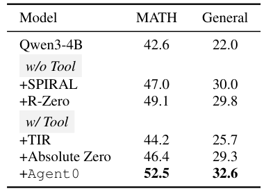)*

cantly outperforms other tool-using baselines, such as Ab-
solute Zero. Agent0 also significantly surpasses non-tool
methods like R-Zero and SPIRAL. This indicates that our
curriculum agent, by using the Rtool reward to explicitly
incentivize the generation of complex tasks requiring tool
use, is far more effective than methods that only use tools
for validation (e.g., Absolute Zero) or do not use tools at all
(e.g., R-Zero). Furthermore, the execution agent utilizes the
tool in conjunction with multi-step reasoning, which also
leads to performance gains, resulting in co-evolution.

Evolution of Task Difficulty and Tool Use. We analyze the
tasks generated by the curriculum agent during the training
iterations. We sample 200 questions from each iteration
for this analysis. As shown in Table 5, the pass rate of the
execution agent (from Iteration 1) progressively decreases
when evaluated on task sets generated by the curriculum
agents from Iterations 1, 2, and 3. This indicates that the
task difficulty is gradually increasing, confirming that the
curriculum adapts to the improvement in the executor’s capa-
bilities. More importantly, the average number of tool calls
per generated task steadily increases across iterations. This
directly proves that our Rtool reward successfully guides the
curriculum agent to generate more complex and tool-reliant
problems, thereby driving a virtuous cycle.

Qualitative Analysis. Figure 5 illustrates the co-evolution
of task complexity and solving proficiency. The Curricu-
lum Agent effectively generates increasingly difficult prob-
lems, progressing from basic geometry (Iter 1) to complex

### VLM Enrichment (figure)
Error during async OCR enrichment: too many concurrent requests (status code: 429)

--
*(Original Snippet: 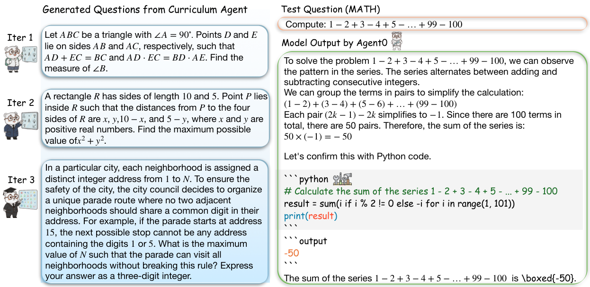)*

**Figure_Caption:** Figure 5. Qualitative Case Analysis. Left: Examples of generated questions showing a clear increase in complexity and diversity from Iter
1 to Iter 3. Right: A demonstration of Agent0’s solving process, utilizing a hybrid approach of mathematical reasoning and Python code
execution to solve a standard MATH problem.

constraint satisfaction tasks (Iter 3). Simultaneously, the
Executor Agent0 demonstrates reliable problem-solving ca-
pabilities. In the provided example, the agent effectively
combines natural language reasoning to identify patterns
with the Python code interpreter to verify calculations, vali-
dating the model’s ability to handle hybrid reasoning tasks.

## 5. Related Work

## 5. Related Work

Self-Evolving from Zero Data. The paradigm of self-
evolution, where LLMs generate their own training data,
has gained significant traction (Liu et al., 2024; Dong et al.,
2024; Fang et al., 2025; Yang et al., 2025b; Kuba et al.,
2025). This approach ranges from dual-agent “Coder-Tester”
setups in verifiable domains (Lin et al., 2025; Wang et al.,
2025e) to fully autonomous frameworks (Zhao et al., 2025;
Huang et al., 2025; Wang et al., 2025d; Liu et al., 2025b; Tao
et al., 2024; Zhang et al., 2025a; Wu et al., 2025b; Lu et al.,
2025) that learn to generate novel problems from scratch.
To guide this learning, many methods use label-free rein-
forcement learning, relying on heuristic reward signals such
as output confidence (Li et al., 2025a) or consistency (Zhang
et al., 2025b; Prabhudesai et al., 2025; Zuo et al., 2025; Yu
et al., 2025c). However, these systems are critically limited
by the model’s inherent knowledge (Han et al., 2025a; Xia
et al., 2025), causing curriculum stagnation as tasks rarely
surpass the model’s current complexity. Agent0 breaks
this cap by integrating an external tool, providing external
problem-solving power. However, without external tools,
such closed-loop systems risk mode collapse and curriculum
stagnation, as they remain bounded by the model’s inherent
knowledge. Agent0 breaks this ceiling by integrating an
external tool to introduce objective problem-solving power.

Tool-Integrated Reasoning (TIR). Applying Reinforce-
ment Learning (RL) (Jaech et al., 2024; Wang et al., 2025c;b;
Zhou et al., 2025c; Wu et al., 2025a; Yang et al.) to enhance
LLM tool-use is a growing field. Many approaches rely on
domain-specific data or supervised fine-tuning (Jin et al.,
2025; Feng et al., 2025; Li et al., 2025b; Geng et al., 2025;
Han et al., 2025b; Su et al., 2025). The more general Zero
RL setting, however, is notoriously unstable in multi-turn
scenarios. Recent advances in TIR address these challenges
through three key dimensions: stability, generalization, and
complexity. To stabilize learning dynamics, methods like
ASPO (Lin & Xu, 2025) and SimpleTIR (Xue et al., 2025)
introduce theoretical guarantees and gradient filtering for
void turns. Beyond stability, (Chen et al., 2025) demonstrate
the cross-domain transferability of tool-use skills. Finally, to
handle complex multi-turn scenarios, advanced techniques
optimize for long-horizon planning (Gao et al., 2025; Erdo-
gan et al., 2025), memory management (Yan et al., 2025),
and interaction efficiency (Wang et al., 2025a).

## 6. Conclusion

We introduce Agent0, a fully autonomous framework
where a curriculum agent and an executor agent co-evolve
without any human-curated data. We integrated a code in-
terpreter into the loop, which creates a virtuous cycle: the
tool-equipped executor’s improving capabilities drive the
curriculum agent to generate progressively harder tasks. Our
experiments show that Agent0 significantly enhances the
reasoning abilities of base LLMs. It demonstrates a scalable
and effective pathway for evolving highly capable agents,
breaking the dependency on human-annotated datasets.

## Acknowledgement

We thank Chengsong Huang for helpful discussions. This
work is partially supported by the AI for Math Fund from Re-
naissance Philanthropy. The Authors also acknowledge the
National Artificial Intelligence Research Resource (NAIRR)
Pilot, Purdue Anvil AI for contributing to this research re-
sult.

## References

Achiam, J., Adler, S., Agarwal, S., Ahmad, L., Akkaya, I.,
Aleman, F. L., Almeida, D., Altenschmidt, J., Altman, S.,
Anadkat, S., et al. Gpt-4 technical report. arXiv preprint
arXiv:2303.08774, 2023.

Anthropic.
Claude code, 2025.
URL https://www.
claude.com/product/claude-code.

Bae, S., Hong, J., Lee, M. Y., Kim, H., Nam, J., and Kwak,
D. Online difficulty filtering for reasoning oriented re-
inforcement learning. arXiv preprint arXiv:2504.03380,
2025.

Chen, Z., Yang, J., Xiao, T., Zhou, R., Zhang, L., Xi, X.,
Shi, X., Wang, W., and Wang, J. Can tool-integrated re-
inforcement learning generalize across diverse domains?
arXiv preprint arXiv:2510.11184, 2025.

Cheng, P., Dai, Y., Hu, T., Xu, H., Zhang, Z., Han, L., Du,
N., and Li, X. Self-playing adversarial language game
enhances llm reasoning. Advances in Neural Information
Processing Systems, 37:126515–126543, 2024.

Achiam, J., Adler, S., Agarwal, S., Ahmad, L., Akkaya, I.,
Aleman, F. L., Almeida, D., Altenschmidt, J., Altman, S.,
Anadkat, S., et al. Gpt-4 technical report. arXiv preprint
arXiv:2303.08774, 2023.
Anthropic.
Claude code, 2025.
URL https://www.
claude.com/product/claude-code.
Bae, S., Hong, J., Lee, M. Y., Kim, H., Nam, J., and Kwak,
D. Online difficulty filtering for reasoning oriented re-
inforcement learning. arXiv preprint arXiv:2504.03380,
2025.
Chen, Z., Yang, J., Xiao, T., Zhou, R., Zhang, L., Xi, X.,
Shi, X., Wang, W., and Wang, J. Can tool-integrated re-
inforcement learning generalize across diverse domains?
arXiv preprint arXiv:2510.11184, 2025.
Cheng, P., Dai, Y., Hu, T., Xu, H., Zhang, Z., Han, L., Du,
N., and Li, X. Self-playing adversarial language game
enhances llm reasoning. Advances in Neural Information
Processing Systems, 37:126515–126543, 2024.
Cheng, Y., Chen, J., Chen, J., Chen, L., Chen, L., Chen, W.,
Chen, Z., Geng, S., Li, A., Li, B., Li, B., Li, L., Liu, B.,
Liu, J., Liu, K., Liu, Q., Liu, S., Liu, S., Liu, T., Liu, T.,
Liu, Y., Long, R., Mai, J., Ning, G., Peng, Z. Y., Shen,
K., Su, J., Su, J., Sun, T., Sun, Y., Tao, Y., Wang, G.,
Wang, S., Wang, X., Wang, Y., Wang, Z., Xia, J., Xiang,
L., Xiao, X., Xiao, Y., Xi, C., Xin, S., Xu, J., Xu, S.,
Yang, H., Yang, J., Yang, Y., Yuan, J., Zhang, J., Zhang,
Y., Zhang, Y., Zheng, S., Zhu, H., and Zhu, M. Fullstack
bench: Evaluating llms as full stack coders, 2025. URL
https://arxiv.org/abs/2412.00535.
Cobbe, K., Kosaraju, V., Bavarian, M., Chen, M., Jun, H.,
Kaiser, L., Plappert, M., Tworek, J., Hilton, J., Nakano,
R., et al. Training verifiers to solve math word problems.
arXiv preprint arXiv:2110.14168, 2021.
Dong, G., Lu, K., Li, C., Xia, T., Yu, B., Zhou, C., and
Zhou, J. Self-play with execution feedback: Improv-
ing instruction-following capabilities of large language
models. arXiv preprint arXiv:2406.13542, 2024.
Du, X., Yao, Y., Ma, K., Wang, B., Zheng, T., Zhu, K., Liu,
M., Liang, Y., Jin, X., Wei, Z., et al. Supergpqa: Scaling

Cheng, Y., Chen, J., Chen, J., Chen, L., Chen, L., Chen, W.,
Chen, Z., Geng, S., Li, A., Li, B., Li, B., Li, L., Liu, B.,
Liu, J., Liu, K., Liu, Q., Liu, S., Liu, S., Liu, T., Liu, T.,
Liu, Y., Long, R., Mai, J., Ning, G., Peng, Z. Y., Shen,
K., Su, J., Su, J., Sun, T., Sun, Y., Tao, Y., Wang, G.,
Wang, S., Wang, X., Wang, Y., Wang, Z., Xia, J., Xiang,
L., Xiao, X., Xiao, Y., Xi, C., Xin, S., Xu, J., Xu, S.,
Yang, H., Yang, J., Yang, Y., Yuan, J., Zhang, J., Zhang,
Y., Zhang, Y., Zheng, S., Zhu, H., and Zhu, M. Fullstack
bench: Evaluating llms as full stack coders, 2025. URL
https://arxiv.org/abs/2412.00535.

Cobbe, K., Kosaraju, V., Bavarian, M., Chen, M., Jun, H.,
Kaiser, L., Plappert, M., Tworek, J., Hilton, J., Nakano,
R., et al. Training verifiers to solve math word problems.
arXiv preprint arXiv:2110.14168, 2021.

Dong, G., Lu, K., Li, C., Xia, T., Yu, B., Zhou, C., and
Zhou, J. Self-play with execution feedback: Improv-
ing instruction-following capabilities of large language
models. arXiv preprint arXiv:2406.13542, 2024.

Du, X., Yao, Y., Ma, K., Wang, B., Zheng, T., Zhu, K., Liu,
M., Liang, Y., Jin, X., Wei, Z., et al. Supergpqa: Scaling

llm evaluation across 285 graduate disciplines. arXiv
preprint arXiv:2502.14739, 2025.

Erdogan, L. E., Lee, N., Kim, S., Moon, S., Furuta, H.,
Anumanchipalli, G., Keutzer, K., and Gholami, A. Plan-
and-act: Improving planning of agents for long-horizon
tasks. arXiv preprint arXiv:2503.09572, 2025.

Fang, W., Liu, S., Zhou, Y., Zhang, K., Zheng, T., Chen, K.,
Song, M., and Tao, D. Serl: Self-play reinforcement learn-
ing for large language models with limited data. arXiv
preprint arXiv:2505.20347, 2025.

Feng, J., Huang, S., Qu, X., Zhang, G., Qin, Y., Zhong, B.,
Jiang, C., Chi, J., and Zhong, W. Retool: Reinforcement
learning for strategic tool use in llms. arXiv preprint
arXiv:2504.11536, 2025.

Gao, J., Fu, W., Xie, M., Xu, S., He, C., Mei, Z., Zhu, B.,
and Wu, Y. Beyond ten turns: Unlocking long-horizon
agentic search with large-scale asynchronous rl. arXiv
preprint arXiv:2508.07976, 2025.

Geng, X., Xia, P., Zhang, Z., Wang, X., Wang, Q., Ding, R.,
Wang, C., Wu, J., Zhao, Y., Li, K., et al. Webwatcher:
Breaking new frontier of vision-language deep research
agent. arXiv preprint arXiv:2508.05748, 2025.

llm evaluation across 285 graduate disciplines. arXiv
preprint arXiv:2502.14739, 2025.
Erdogan, L. E., Lee, N., Kim, S., Moon, S., Furuta, H.,
Anumanchipalli, G., Keutzer, K., and Gholami, A. Plan-
and-act: Improving planning of agents for long-horizon
tasks. arXiv preprint arXiv:2503.09572, 2025.
Fang, W., Liu, S., Zhou, Y., Zhang, K., Zheng, T., Chen, K.,
Song, M., and Tao, D. Serl: Self-play reinforcement learn-
ing for large language models with limited data. arXiv
preprint arXiv:2505.20347, 2025.
Feng, J., Huang, S., Qu, X., Zhang, G., Qin, Y., Zhong, B.,
Jiang, C., Chi, J., and Zhong, W. Retool: Reinforcement
learning for strategic tool use in llms. arXiv preprint
arXiv:2504.11536, 2025.
Gao, J., Fu, W., Xie, M., Xu, S., He, C., Mei, Z., Zhu, B.,
and Wu, Y. Beyond ten turns: Unlocking long-horizon
agentic search with large-scale asynchronous rl. arXiv
preprint arXiv:2508.07976, 2025.
Geng, X., Xia, P., Zhang, Z., Wang, X., Wang, Q., Ding, R.,
Wang, C., Wu, J., Zhao, Y., Li, K., et al. Webwatcher:
Breaking new frontier of vision-language deep research
agent. arXiv preprint arXiv:2508.05748, 2025.
Google.
Try
deep
research
and
our
new
ex-
perimental
model
in
gemini,
your
ai
assistant,
2024. URL https://blog.google/products/
gemini/google-gemini-deep-research/.
Han, S., Liu, J., Su, Y., Duan, W., Liu, X., Xie, C., Bansal,
M., Ding, M., Zhang, L., and Yao, H. Alignment tipping
process: How self-evolution pushes llm agents off the
rails. arXiv preprint arXiv:2510.04860, 2025a.
Han, S., Xia, P., Zhang, R., Sun, T., Li, Y., Zhu, H.,
and Yao, H. Mdocagent: A multi-modal multi-agent
framework for document understanding. arXiv preprint
arXiv:2503.13964, 2025b.
He, C., Luo, R., Bai, Y., Hu, S., Thai, Z. L., Shen, J., Hu, J.,
Han, X., Huang, Y., Zhang, Y., et al. Olympiadbench: A
challenging benchmark for promoting agi with olympiad-
level bilingual multimodal scientific problems. arXiv
preprint arXiv:2402.14008, 2024.
Hendrycks, D., Burns, C., Basart, S., Zou, A., Mazeika,
M., Song, D., and Steinhardt, J.
Measuring mas-
sive multitask language understanding. arXiv preprint
arXiv:2009.03300, 2020.
Hendrycks, D., Burns, C., Kadavath, S., Arora, A., Basart,
S., Tang, E., Song, D., and Steinhardt, J. Measuring math-
ematical problem solving with the math dataset. arXiv
preprint arXiv:2103.03874, 2021.

Google.
Try
deep
research
and
our
new
ex-
perimental
model
in
gemini,
your
ai
assistant,
2024. URL https://blog.google/products/
gemini/google-gemini-deep-research/.

Han, S., Liu, J., Su, Y., Duan, W., Liu, X., Xie, C., Bansal,
M., Ding, M., Zhang, L., and Yao, H. Alignment tipping
process: How self-evolution pushes llm agents off the
rails. arXiv preprint arXiv:2510.04860, 2025a.

Han, S., Xia, P., Zhang, R., Sun, T., Li, Y., Zhu, H.,
and Yao, H. Mdocagent: A multi-modal multi-agent
framework for document understanding. arXiv preprint
arXiv:2503.13964, 2025b.

He, C., Luo, R., Bai, Y., Hu, S., Thai, Z. L., Shen, J., Hu, J.,
Han, X., Huang, Y., Zhang, Y., et al. Olympiadbench: A
challenging benchmark for promoting agi with olympiad-
level bilingual multimodal scientific problems. arXiv
preprint arXiv:2402.14008, 2024.

Hendrycks, D., Burns, C., Basart, S., Zou, A., Mazeika,
M., Song, D., and Steinhardt, J.
Measuring mas-
sive multitask language understanding. arXiv preprint
arXiv:2009.03300, 2020.

Hendrycks, D., Burns, C., Kadavath, S., Arora, A., Basart,
S., Tang, E., Song, D., and Steinhardt, J. Measuring math-
ematical problem solving with the math dataset. arXiv
preprint arXiv:2103.03874, 2021.

Huang, C., Yu, W., Wang, X., Zhang, H., Li, Z., Li, R.,
Huang, J., Mi, H., and Yu, D. R-zero: Self-evolving
reasoning llm from zero data. 2025. URL https://
arxiv.org/abs/2508.05004.

Jaech, A., Kalai, A., Lerer, A., Richardson, A., El-Kishky,
A., Low, A., Helyar, A., Madry, A., Beutel, A., Car-
ney, A., et al. Openai o1 system card. arXiv preprint
arXiv:2412.16720, 2024.

Jiang, D., Lu, Y., Li, Z., Lyu, Z., Nie, P., Wang, H., Su, A.,
Chen, H., Zou, K., Du, C., et al. Verltool: Towards holis-
tic agentic reinforcement learning with tool use. arXiv
preprint arXiv:2509.01055, 2025.

Jimenez, C. E., Yang, J., Wettig, A., Yao, S., Pei, K., Press,
O., and Narasimhan, K. Swe-bench: Can language mod-
els resolve real-world github issues?
arXiv preprint
arXiv:2310.06770, 2023.

Jin, B., Zeng, H., Yue, Z., Yoon, J., Arik, S., Wang, D.,
Zamani, H., and Han, J. Search-r1: Training llms to
reason and leverage search engines with reinforcement
learning. arXiv preprint arXiv:2503.09516, 2025.

Kazemi, M., Fatemi, B., Bansal, H., Palowitch, J., Anas-
tasiou, C., Mehta, S. V., Jain, L. K., Aglietti, V., Jindal,
D., Chen, P., et al. Big-bench extra hard. arXiv preprint
arXiv:2502.19187, 2025.

Huang, C., Yu, W., Wang, X., Zhang, H., Li, Z., Li, R.,
Huang, J., Mi, H., and Yu, D. R-zero: Self-evolving
reasoning llm from zero data. 2025. URL https://
arxiv.org/abs/2508.05004.
Jaech, A., Kalai, A., Lerer, A., Richardson, A., El-Kishky,
A., Low, A., Helyar, A., Madry, A., Beutel, A., Car-
ney, A., et al. Openai o1 system card. arXiv preprint
arXiv:2412.16720, 2024.
Jiang, D., Lu, Y., Li, Z., Lyu, Z., Nie, P., Wang, H., Su, A.,
Chen, H., Zou, K., Du, C., et al. Verltool: Towards holis-
tic agentic reinforcement learning with tool use. arXiv
preprint arXiv:2509.01055, 2025.
Jimenez, C. E., Yang, J., Wettig, A., Yao, S., Pei, K., Press,
O., and Narasimhan, K. Swe-bench: Can language mod-
els resolve real-world github issues?
arXiv preprint
arXiv:2310.06770, 2023.
Jin, B., Zeng, H., Yue, Z., Yoon, J., Arik, S., Wang, D.,
Zamani, H., and Han, J. Search-r1: Training llms to
reason and leverage search engines with reinforcement
learning. arXiv preprint arXiv:2503.09516, 2025.
Kazemi, M., Fatemi, B., Bansal, H., Palowitch, J., Anas-
tasiou, C., Mehta, S. V., Jain, L. K., Aglietti, V., Jindal,
D., Chen, P., et al. Big-bench extra hard. arXiv preprint
arXiv:2502.19187, 2025.
Kuba, J. G., Gu, M., Ma, Q., Tian, Y., and Mohan, V. Lan-
guage self-play for data-free training. arXiv preprint
arXiv:2509.07414, 2025.
Kwon, W., Li, Z., Zhuang, S., Sheng, Y., Zheng, L., Yu,
C. H., Gonzalez, J. E., Zhang, H., and Stoica, I. Efficient
memory management for large language model serving
with pagedattention. In Proceedings of the ACM SIGOPS
29th Symposium on Operating Systems Principles, 2023.
Lewkowycz, A., Andreassen, A., Dohan, D., Dyer, E.,
Michalewski, H., Ramasesh, V., Slone, A., Anil, C.,
Schlag, I., Gutman-Solo, T., et al. Solving quantitative
reasoning problems with language models. Advances in
neural information processing systems, 35:3843–3857,
2022.
Li, P., Skripkin, M., Zubrey, A., Kuznetsov, A., and
Oseledets, I.
Confidence is all you need: Few-shot
rl fine-tuning of language models.
arXiv preprint
arXiv:2506.06395, 2025a.
Li, X., Zou, H., and Liu, P. Torl: Scaling tool-integrated rl.
arXiv preprint arXiv:2503.23383, 2025b.
Li, Y., Shen, X., Yao, X., Ding, X., Miao, Y., Krishnan,
R., and Padman, R. Beyond single-turn: A survey on
multi-turn interactions with large language models. arXiv
preprint arXiv:2504.04717, 2025c.

Kuba, J. G., Gu, M., Ma, Q., Tian, Y., and Mohan, V. Lan-
guage self-play for data-free training. arXiv preprint
arXiv:2509.07414, 2025.

Kwon, W., Li, Z., Zhuang, S., Sheng, Y., Zheng, L., Yu,
C. H., Gonzalez, J. E., Zhang, H., and Stoica, I. Efficient
memory management for large language model serving
with pagedattention. In Proceedings of the ACM SIGOPS
29th Symposium on Operating Systems Principles, 2023.

Lewkowycz, A., Andreassen, A., Dohan, D., Dyer, E.,
Michalewski, H., Ramasesh, V., Slone, A., Anil, C.,
Schlag, I., Gutman-Solo, T., et al. Solving quantitative
reasoning problems with language models. Advances in
neural information processing systems, 35:3843–3857,
2022.

Li, P., Skripkin, M., Zubrey, A., Kuznetsov, A., and
Oseledets, I.
Confidence is all you need: Few-shot
rl fine-tuning of language models.
arXiv preprint
arXiv:2506.06395, 2025a.

Li, X., Zou, H., and Liu, P. Torl: Scaling tool-integrated rl.
arXiv preprint arXiv:2503.23383, 2025b.

Li, Y., Shen, X., Yao, X., Ding, X., Miao, Y., Krishnan,
R., and Padman, R. Beyond single-turn: A survey on
multi-turn interactions with large language models. arXiv
preprint arXiv:2504.04717, 2025c.

Lin, H. and Xu, Z. Understanding tool-integrated reasoning.
arXiv preprint arXiv:2508.19201, 2025.

Lin, Z., Shen, S., Shang, J., Weston, J., and Nie, Y. Learning
to solve and verify: A self-play framework for code and
test generation. arXiv preprint arXiv:2502.14948, 2025.

Liu, B., Guertler, L., Yu, S., Liu, Z., Qi, P., Balcells, D.,
Liu, M., Tan, C., Shi, W., Lin, M., Lee, W. S., and Jaques,
N. Spiral: Self-play on zero-sum games incentivizes rea-
soning via multi-agent multi-turn reinforcement learning.
arXiv preprint arXiv:2506.24119, 2025a.

Liu, B., Jin, C., Kim, S., Yuan, W., Zhao, W., Kulikov, I., Li,
X., Sukhbaatar, S., Lanchantin, J., and Weston, J. Spice:
Self-play in corpus environments improves reasoning.
arXiv preprint arXiv:2510.24684, 2025b.

Liu, Y., Sun, P., and Li, H. Large language models as agents
in two-player games. arXiv preprint arXiv:2402.08078,
2024.

Lu, H., Wen, Y., Cheng, P., Ding, R., Xu, H., Guo, J.,
Wang, C., Chen, H., Jiang, X., and Jiang, G. Search
self-play: Pushing the frontier of agent capability without
supervision. arXiv preprint arXiv:2510.18821, 2025.

Lin, H. and Xu, Z. Understanding tool-integrated reasoning.
arXiv preprint arXiv:2508.19201, 2025.
Lin, Z., Shen, S., Shang, J., Weston, J., and Nie, Y. Learning
to solve and verify: A self-play framework for code and
test generation. arXiv preprint arXiv:2502.14948, 2025.
Liu, B., Guertler, L., Yu, S., Liu, Z., Qi, P., Balcells, D.,
Liu, M., Tan, C., Shi, W., Lin, M., Lee, W. S., and Jaques,
N. Spiral: Self-play on zero-sum games incentivizes rea-
soning via multi-agent multi-turn reinforcement learning.
arXiv preprint arXiv:2506.24119, 2025a.
Liu, B., Jin, C., Kim, S., Yuan, W., Zhao, W., Kulikov, I., Li,
X., Sukhbaatar, S., Lanchantin, J., and Weston, J. Spice:
Self-play in corpus environments improves reasoning.
arXiv preprint arXiv:2510.24684, 2025b.
Liu, Y., Sun, P., and Li, H. Large language models as agents
in two-player games. arXiv preprint arXiv:2402.08078,
2024.
Lu, H., Wen, Y., Cheng, P., Ding, R., Xu, H., Guo, J.,
Wang, C., Chen, H., Jiang, X., and Jiang, G. Search
self-play: Pushing the frontier of agent capability without
supervision. arXiv preprint arXiv:2510.18821, 2025.
OpenAI.
Openai
deep
research
system
card,
2025.
URL
https://openai.com/index/
introducing-deep-research/.
Ouyang, L., Wu, J., Jiang, X., Almeida, D., Wainwright, C.,
Mishkin, P., Zhang, C., Agarwal, S., Slama, K., Ray, A.,
et al. Training language models to follow instructions
with human feedback. Advances in neural information
processing systems, 35:27730–27744, 2022.
Papineni, K., Roukos, S., Ward, T., and Zhu, W.-J. Bleu:
a method for automatic evaluation of machine transla-
tion. In Proceedings of the 40th annual meeting of the
Association for Computational Linguistics, pp. 311–318,
2002.
Prabhudesai, M., Chen, L., Ippoliti, A., Fragkiadaki, K.,
Liu, H., and Pathak, D. Maximizing confidence alone
improves reasoning. arXiv preprint arXiv:2505.22660,
2025.
Qiu, J., Qi, X., Wang, H., Juan, X., Wang, Y., Zhao, Z.,
Geng, J., Guo, J., Li, P., Shi, J., et al. Alita-g: Self-
evolving generative agent for agent generation. arXiv
preprint arXiv:2510.23601, 2025a.
Qiu, J., Qi, X., Zhang, T., Juan, X., Guo, J., Lu, Y., Wang,
Y., Yao, Z., Ren, Q., Jiang, X., et al. Alita: Generalist
agent enabling scalable agentic reasoning with minimal
predefinition and maximal self-evolution. arXiv preprint
arXiv:2505.20286, 2025b.

Qiu, J., Qi, X., Wang, H., Juan, X., Wang, Y., Zhao, Z.,
Geng, J., Guo, J., Li, P., Shi, J., et al. Alita-g: Self-
evolving generative agent for agent generation. arXiv
preprint arXiv:2510.23601, 2025a.

Qiu, J., Qi, X., Zhang, T., Juan, X., Guo, J., Lu, Y., Wang,
Y., Yao, Z., Ren, Q., Jiang, X., et al. Alita: Generalist
agent enabling scalable agentic reasoning with minimal
predefinition and maximal self-evolution. arXiv preprint
arXiv:2505.20286, 2025b.

Rein, D., Hou, B. L., Stickland, A. C., Petty, J., Pang, R. Y.,
Dirani, J., Michael, J., and Bowman, S. R. Gpqa: A
graduate-level google-proof q&a benchmark. In First
Conference on Language Modeling, 2024.

Schulman, J., Wolski, F., Dhariwal, P., Radford, A., and
Klimov, O. Proximal policy optimization algorithms.
ArXiv preprint, abs/1707.06347, 2017. URL https:
//arxiv.org/abs/1707.06347.

Shao, Z., Wang, P., Zhu, Q., Xu, R., Song, J., Bi, X., Zhang,
H., Zhang, M., Li, Y., Wu, Y., et al. Deepseekmath: Push-
ing the limits of mathematical reasoning in open language
models. arXiv preprint arXiv:2402.03300, 2024.

Sheng, G., Zhang, C., Ye, Z., Wu, X., Zhang, W., Zhang, R.,
Peng, Y., Lin, H., and Wu, C. Hybridflow: A flexible and
efficient rlhf framework. In Proceedings of the Twentieth
European Conference on Computer Systems, pp. 1279–
1297, 2025.

Shi, T., Wu, Y., Song, L., Zhou, T., and Zhao, J. Efficient
reinforcement finetuning via adaptive curriculum learning.
arXiv preprint arXiv:2504.05520, 2025.

Srivastava, A., Rastogi, A., Rao, A., Shoeb, A. A. M., Abid,
A., Fisch, A., Brown, A. R., Santoro, A., Gupta, A.,
Garriga-Alonso, A., et al. Beyond the imitation game:
Quantifying and extrapolating the capabilities of language
models.
Transactions on machine learning research,
2023.

Rein, D., Hou, B. L., Stickland, A. C., Petty, J., Pang, R. Y.,
Dirani, J., Michael, J., and Bowman, S. R. Gpqa: A
graduate-level google-proof q&a benchmark. In First
Conference on Language Modeling, 2024.
Schulman, J., Wolski, F., Dhariwal, P., Radford, A., and
Klimov, O. Proximal policy optimization algorithms.
ArXiv preprint, abs/1707.06347, 2017. URL https:
//arxiv.org/abs/1707.06347.
Shao, Z., Wang, P., Zhu, Q., Xu, R., Song, J., Bi, X., Zhang,
H., Zhang, M., Li, Y., Wu, Y., et al. Deepseekmath: Push-
ing the limits of mathematical reasoning in open language
models. arXiv preprint arXiv:2402.03300, 2024.
Sheng, G., Zhang, C., Ye, Z., Wu, X., Zhang, W., Zhang, R.,
Peng, Y., Lin, H., and Wu, C. Hybridflow: A flexible and
efficient rlhf framework. In Proceedings of the Twentieth
European Conference on Computer Systems, pp. 1279–
1297, 2025.
Shi, T., Wu, Y., Song, L., Zhou, T., and Zhao, J. Efficient
reinforcement finetuning via adaptive curriculum learning.
arXiv preprint arXiv:2504.05520, 2025.
Srivastava, A., Rastogi, A., Rao, A., Shoeb, A. A. M., Abid,
A., Fisch, A., Brown, A. R., Santoro, A., Gupta, A.,
Garriga-Alonso, A., et al. Beyond the imitation game:
Quantifying and extrapolating the capabilities of language
models.
Transactions on machine learning research,
2023.
Su, Z., Xia, P., Guo, H., Liu, Z., Ma, Y., Qu, X., Liu, J., Li,
Y., Zeng, K., Yang, Z., et al. Thinking with images for
multimodal reasoning: Foundations, methods, and future
frontiers. arXiv preprint arXiv:2506.23918, 2025.
Tang, X., Qin, T., Peng, T., Zhou, Z., Shao, D., Du, T., Wei,
X., Xia, P., Wu, F., Zhu, H., et al. Agent kb: Leveraging
cross-domain experience for agentic problem solving.
arXiv preprint arXiv:2507.06229, 2025.
Tao, Z., Lin, T.-E., Chen, X., Li, H., Wu, Y., Li, Y., Jin,
Z., Huang, F., Tao, D., and Zhou, J.
A survey on
self-evolution of large language models. arXiv preprint
arXiv:2404.14387, 2024.
Team, T. D., Li, B., Zhang, B., Zhang, D., Huang, F., Li, G.,
Chen, G., Yin, H., Wu, J., Zhou, J., et al. Tongyi deepre-
search technical report. arXiv preprint arXiv:2510.24701,
2025.
Tu, A., Xuan, W., Qi, H., Huang, X., Zeng, Q., Talaei, S.,
Xiao, Y., Xia, P., Tang, X., Zhuang, Y., et al. Position:
The hidden costs and measurement gaps of reinforce-
ment learning with verifiable rewards. arXiv preprint
arXiv:2509.21882, 2025.

Su, Z., Xia, P., Guo, H., Liu, Z., Ma, Y., Qu, X., Liu, J., Li,
Y., Zeng, K., Yang, Z., et al. Thinking with images for
multimodal reasoning: Foundations, methods, and future
frontiers. arXiv preprint arXiv:2506.23918, 2025.

Tang, X., Qin, T., Peng, T., Zhou, Z., Shao, D., Du, T., Wei,
X., Xia, P., Wu, F., Zhu, H., et al. Agent kb: Leveraging
cross-domain experience for agentic problem solving.
arXiv preprint arXiv:2507.06229, 2025.

Tao, Z., Lin, T.-E., Chen, X., Li, H., Wu, Y., Li, Y., Jin,
Z., Huang, F., Tao, D., and Zhou, J.
A survey on
self-evolution of large language models. arXiv preprint
arXiv:2404.14387, 2024.

Team, T. D., Li, B., Zhang, B., Zhang, D., Huang, F., Li, G.,
Chen, G., Yin, H., Wu, J., Zhou, J., et al. Tongyi deepre-
search technical report. arXiv preprint arXiv:2510.24701,
2025.

Tu, A., Xuan, W., Qi, H., Huang, X., Zeng, Q., Talaei, S.,
Xiao, Y., Xia, P., Tang, X., Zhuang, Y., et al. Position:
The hidden costs and measurement gaps of reinforce-
ment learning with verifiable rewards. arXiv preprint
arXiv:2509.21882, 2025.

Wang, H., Qian, C., Zhong, W., Chen, X., Qiu, J., Huang, S.,
Jin, B., Wang, M., Wong, K.-F., and Ji, H. Otc: Optimal
tool calls via reinforcement learning. arXiv e-prints, pp.
arXiv–2504, 2025a.

Wang, H., Que, H., Xu, Q., Liu, M., Zhou, W., Feng, J.,
Zhong, W., Ye, W., Yang, T., Huang, W., et al. Reverse-
engineered reasoning for open-ended generation. arXiv
preprint arXiv:2509.06160, 2025b.

Wang, H., Xu, Q., Liu, C., Wu, J., Lin, F., and Chen, W.
Emergent hierarchical reasoning in llms through rein-
forcement learning. arXiv preprint arXiv:2509.03646,
2025c.

Wang, S., Jiao, Z., Zhang, Z., Peng, Y., Ze, X., Yang,
B., Wang, W., Wei, H., and Zhang, L. Socratic-zero:
Bootstrapping reasoning via data-free agent co-evolution.
arXiv preprint arXiv:2509.24726, 2025d.

Wang, X., Li, B., Song, Y., Xu, F. F., Tang, X., Zhuge, M.,
Pan, J., Song, Y., Li, B., Singh, J., et al. Openhands: An
open platform for ai software developers as generalist
agents. arXiv preprint arXiv:2407.16741, 2024a.

Wang, Y., Ma, X., Zhang, G., Ni, Y., Chandra, A., Guo, S.,
Ren, W., Arulraj, A., He, X., Jiang, Z., et al. Mmlu-pro:
A more robust and challenging multi-task language un-
derstanding benchmark. Advances in Neural Information
Processing Systems, 37:95266–95290, 2024b.

Wang, H., Qian, C., Zhong, W., Chen, X., Qiu, J., Huang, S.,
Jin, B., Wang, M., Wong, K.-F., and Ji, H. Otc: Optimal
tool calls via reinforcement learning. arXiv e-prints, pp.
arXiv–2504, 2025a.
Wang, H., Que, H., Xu, Q., Liu, M., Zhou, W., Feng, J.,
Zhong, W., Ye, W., Yang, T., Huang, W., et al. Reverse-
engineered reasoning for open-ended generation. arXiv
preprint arXiv:2509.06160, 2025b.
Wang, H., Xu, Q., Liu, C., Wu, J., Lin, F., and Chen, W.
Emergent hierarchical reasoning in llms through rein-
forcement learning. arXiv preprint arXiv:2509.03646,
2025c.
Wang, S., Jiao, Z., Zhang, Z., Peng, Y., Ze, X., Yang,
B., Wang, W., Wei, H., and Zhang, L. Socratic-zero:
Bootstrapping reasoning via data-free agent co-evolution.
arXiv preprint arXiv:2509.24726, 2025d.
Wang, X., Li, B., Song, Y., Xu, F. F., Tang, X., Zhuge, M.,
Pan, J., Song, Y., Li, B., Singh, J., et al. Openhands: An
open platform for ai software developers as generalist
agents. arXiv preprint arXiv:2407.16741, 2024a.
Wang, Y., Ma, X., Zhang, G., Ni, Y., Chandra, A., Guo, S.,
Ren, W., Arulraj, A., He, X., Jiang, Z., et al. Mmlu-pro:
A more robust and challenging multi-task language un-
derstanding benchmark. Advances in Neural Information
Processing Systems, 37:95266–95290, 2024b.
Wang, Y., Yang, L., Tian, Y., Shen, K., and Wang, M. Co-
evolving llm coder and unit tester via reinforcement learn-
ing. arXiv preprint arXiv:2506.03136, 2025e.
Wu, F., Huang, X., Xuan, W., Zhang, Z., Xiao, Y., Wan,
G., Li, X., Hu, B., Xia, P., Leskovec, J., et al. Mul-
tiplayer nash preference optimization. arXiv preprint
arXiv:2509.23102, 2025a.
Wu, R., Wang, X., Mei, J., Cai, P., Fu, D., Yang, C., Wen, L.,
Yang, X., Shen, Y., Wang, Y., et al. Evolver: Self-evolving
llm agents through an experience-driven lifecycle. arXiv
preprint arXiv:2510.16079, 2025b.
Xia, P., Wang, J., Peng, Y., Zeng, K., Wu, X., Tang, X., Zhu,
H., Li, Y., Liu, S., Lu, Y., et al. Mmedagent-rl: Opti-
mizing multi-agent collaboration for multimodal medical
reasoning. arXiv preprint arXiv:2506.00555, 2025.
Xue, Z., Zheng, L., Liu, Q., Li, Y., Zheng, X., Ma, Z., and
An, B. Simpletir: End-to-end reinforcement learning
for multi-turn tool-integrated reasoning. arXiv preprint
arXiv:2509.02479, 2025.
Yan, S., Yang, X., Huang, Z., Nie, E., Ding, Z., Li, Z., Ma,
X., Kersting, K., Pan, J. Z., Sch¨utze, H., et al. Memory-
r1: Enhancing large language model agents to manage

Wang, H., Qian, C., Zhong, W., Chen, X., Qiu, J., Huang, S.,
Jin, B., Wang, M., Wong, K.-F., and Ji, H. Otc: Optimal
tool calls via reinforcement learning. arXiv e-prints, pp.
arXiv–2504, 2025a.
Wang, H., Que, H., Xu, Q., Liu, M., Zhou, W., Feng, J.,
Zhong, W., Ye, W., Yang, T., Huang, W., et al. Reverse-
engineered reasoning for open-ended generation. arXiv
preprint arXiv:2509.06160, 2025b.
Wang, H., Xu, Q., Liu, C., Wu, J., Lin, F., and Chen, W.
Emergent hierarchical reasoning in llms through rein-
forcement learning. arXiv preprint arXiv:2509.03646,
2025c.
Wang, S., Jiao, Z., Zhang, Z., Peng, Y., Ze, X., Yang,
B., Wang, W., Wei, H., and Zhang, L. Socratic-zero:
Bootstrapping reasoning via data-free agent co-evolution.
arXiv preprint arXiv:2509.24726, 2025d.
Wang, X., Li, B., Song, Y., Xu, F. F., Tang, X., Zhuge, M.,
Pan, J., Song, Y., Li, B., Singh, J., et al. Openhands: An
open platform for ai software developers as generalist
agents. arXiv preprint arXiv:2407.16741, 2024a.
Wang, Y., Ma, X., Zhang, G., Ni, Y., Chandra, A., Guo, S.,
Ren, W., Arulraj, A., He, X., Jiang, Z., et al. Mmlu-pro:
A more robust and challenging multi-task language un-
derstanding benchmark. Advances in Neural Information
Processing Systems, 37:95266–95290, 2024b.
Wang, Y., Yang, L., Tian, Y., Shen, K., and Wang, M. Co-
evolving llm coder and unit tester via reinforcement learn-
ing. arXiv preprint arXiv:2506.03136, 2025e.
Wu, F., Huang, X., Xuan, W., Zhang, Z., Xiao, Y., Wan,
G., Li, X., Hu, B., Xia, P., Leskovec, J., et al. Mul-
tiplayer nash preference optimization. arXiv preprint
arXiv:2509.23102, 2025a.
Wu, R., Wang, X., Mei, J., Cai, P., Fu, D., Yang, C., Wen, L.,
Yang, X., Shen, Y., Wang, Y., et al. Evolver: Self-evolving
llm agents through an experience-driven lifecycle. arXiv
preprint arXiv:2510.16079, 2025b.
Xia, P., Wang, J., Peng, Y., Zeng, K., Wu, X., Tang, X., Zhu,
H., Li, Y., Liu, S., Lu, Y., et al. Mmedagent-rl: Opti-
mizing multi-agent collaboration for multimodal medical
reasoning. arXiv preprint arXiv:2506.00555, 2025.
Xue, Z., Zheng, L., Liu, Q., Li, Y., Zheng, X., Ma, Z., and
An, B. Simpletir: End-to-end reinforcement learning
for multi-turn tool-integrated reasoning. arXiv preprint
arXiv:2509.02479, 2025.
Yan, S., Yang, X., Huang, Z., Nie, E., Ding, Z., Li, Z., Ma,
X., Kersting, K., Pan, J. Z., Sch¨utze, H., et al. Memory-
r1: Enhancing large language model agents to manage

Wang, Y., Yang, L., Tian, Y., Shen, K., and Wang, M. Co-
evolving llm coder and unit tester via reinforcement learn-
ing. arXiv preprint arXiv:2506.03136, 2025e.

Wu, F., Huang, X., Xuan, W., Zhang, Z., Xiao, Y., Wan,
G., Li, X., Hu, B., Xia, P., Leskovec, J., et al. Mul-
tiplayer nash preference optimization. arXiv preprint
arXiv:2509.23102, 2025a.

Wu, R., Wang, X., Mei, J., Cai, P., Fu, D., Yang, C., Wen, L.,
Yang, X., Shen, Y., Wang, Y., et al. Evolver: Self-evolving
llm agents through an experience-driven lifecycle. arXiv
preprint arXiv:2510.16079, 2025b.

Xia, P., Wang, J., Peng, Y., Zeng, K., Wu, X., Tang, X., Zhu,
H., Li, Y., Liu, S., Lu, Y., et al. Mmedagent-rl: Opti-
mizing multi-agent collaboration for multimodal medical
reasoning. arXiv preprint arXiv:2506.00555, 2025.

Xue, Z., Zheng, L., Liu, Q., Li, Y., Zheng, X., Ma, Z., and
An, B. Simpletir: End-to-end reinforcement learning
for multi-turn tool-integrated reasoning. arXiv preprint
arXiv:2509.02479, 2025.

Yan, S., Yang, X., Huang, Z., Nie, E., Ding, Z., Li, Z., Ma,
X., Kersting, K., Pan, J. Z., Sch¨utze, H., et al. Memory-
r1: Enhancing large language model agents to manage

and utilize memories via reinforcement learning. arXiv
preprint arXiv:2508.19828, 2025.

Yang, A., Li, A., Yang, B., Zhang, B., Hui, B., Zheng, B.,
Yu, B., Gao, C., Huang, C., Lv, C., et al. Qwen3 technical
report. arXiv preprint arXiv:2505.09388, 2025a.

Yang, X., Han, J., Bommasani, R., Luo, J., Qu, W., Zhou,
W., Bibi, A., Wang, X., Yoon, J., Stengel-Eskin, E., et al.
Reliable and responsible foundation models. Transac-
tions on Machine Learning Research.

Yang, Z., Shen, W., Chen, R., Li, C., Wan, F., Yan, M., Quan,
X., and Huang, F. Spell: Self-play reinforcement learn-
ing for evolving long-context language models. arXiv
preprint arXiv:2509.23863, 2025b.

Yu, H., Chen, T., Feng, J., Chen, J., Dai, W., Yu, Q., Zhang,
Y.-Q., Ma, W.-Y., Liu, J., Wang, M., et al. Memagent: Re-
shaping long-context llm with multi-conv rl-based mem-
ory agent. arXiv preprint arXiv:2507.02259, 2025a.

Yu, Q., Zhang, Z., Zhu, R., Yuan, Y., Zuo, X., Yue, Y., Dai,
W., Fan, T., Liu, G., Liu, L., et al. Dapo: An open-source
llm reinforcement learning system at scale. arXiv preprint
arXiv:2503.14476, 2025b.

and utilize memories via reinforcement learning. arXiv
preprint arXiv:2508.19828, 2025.
Yang, A., Li, A., Yang, B., Zhang, B., Hui, B., Zheng, B.,
Yu, B., Gao, C., Huang, C., Lv, C., et al. Qwen3 technical
report. arXiv preprint arXiv:2505.09388, 2025a.
Yang, X., Han, J., Bommasani, R., Luo, J., Qu, W., Zhou,
W., Bibi, A., Wang, X., Yoon, J., Stengel-Eskin, E., et al.
Reliable and responsible foundation models. Transac-
tions on Machine Learning Research.
Yang, Z., Shen, W., Chen, R., Li, C., Wan, F., Yan, M., Quan,
X., and Huang, F. Spell: Self-play reinforcement learn-
ing for evolving long-context language models. arXiv
preprint arXiv:2509.23863, 2025b.
Yu, H., Chen, T., Feng, J., Chen, J., Dai, W., Yu, Q., Zhang,
Y.-Q., Ma, W.-Y., Liu, J., Wang, M., et al. Memagent: Re-
shaping long-context llm with multi-conv rl-based mem-
ory agent. arXiv preprint arXiv:2507.02259, 2025a.
Yu, Q., Zhang, Z., Zhu, R., Yuan, Y., Zuo, X., Yue, Y., Dai,
W., Fan, T., Liu, G., Liu, L., et al. Dapo: An open-source
llm reinforcement learning system at scale. arXiv preprint
arXiv:2503.14476, 2025b.
Yu, Z., Su, W., Tao, L., Wang, H., Singh, A., Yu, H.,
Wang, J., Gao, H., Yuan, W., Weston, J., et al. Restrain:
From spurious votes to signals–self-driven rl with self-
penalization. arXiv preprint arXiv:2510.02172, 2025c.
Yue, Y., Chen, Z., Lu, R., Zhao, A., Wang, Z., Song, S., and
Huang, G. Does reinforcement learning really incentivize
reasoning capacity in llms beyond the base model? arXiv
preprint arXiv:2504.13837, 2025.
Zhai, Y., Tao, S., Chen, C., Zou, A., Chen, Z., Fu, Q., Mai,
S., Yu, L., Deng, J., Cao, Z., et al. Agentevolver: To-
wards efficient self-evolving agent system. arXiv preprint
arXiv:2511.10395, 2025.
Zhang, D.-C., Zhao, Y., Wu, J., Zhang, L., Li, B., Yin, W.,
Jiang, Y., Li, Y.-F., Tu, K., Xie, P., et al. Evolvesearch:
An iterative self-evolving search agent. In Proceedings
of the 2025 Conference on Empirical Methods in Natural
Language Processing, pp. 13134–13147, 2025a.
Zhang, K., Yao, Q., Liu, S., Wang, Y., Lai, B., Ye, J.,
Song, M., and Tao, D. Consistent paths lead to truth:
Self-rewarding reinforcement learning for llm reasoning.
arXiv preprint arXiv:2506.08745, 2025b.
Zhang, K., Zuo, Y., He, B., Sun, Y., Liu, R., Jiang, C.,
Fan, Y., Tian, K., Jia, G., Li, P., et al.
A survey of
reinforcement learning for large reasoning models. arXiv
preprint arXiv:2509.08827, 2025c.

Yu, Z., Su, W., Tao, L., Wang, H., Singh, A., Yu, H.,
Wang, J., Gao, H., Yuan, W., Weston, J., et al. Restrain:
From spurious votes to signals–self-driven rl with self-
penalization. arXiv preprint arXiv:2510.02172, 2025c.

Yue, Y., Chen, Z., Lu, R., Zhao, A., Wang, Z., Song, S., and
Huang, G. Does reinforcement learning really incentivize
reasoning capacity in llms beyond the base model? arXiv
preprint arXiv:2504.13837, 2025.

Zhai, Y., Tao, S., Chen, C., Zou, A., Chen, Z., Fu, Q., Mai,
S., Yu, L., Deng, J., Cao, Z., et al. Agentevolver: To-
wards efficient self-evolving agent system. arXiv preprint
arXiv:2511.10395, 2025.

Zhang, D.-C., Zhao, Y., Wu, J., Zhang, L., Li, B., Yin, W.,
Jiang, Y., Li, Y.-F., Tu, K., Xie, P., et al. Evolvesearch:
An iterative self-evolving search agent. In Proceedings
of the 2025 Conference on Empirical Methods in Natural
Language Processing, pp. 13134–13147, 2025a.

Zhang, K., Yao, Q., Liu, S., Wang, Y., Lai, B., Ye, J.,
Song, M., and Tao, D. Consistent paths lead to truth:
Self-rewarding reinforcement learning for llm reasoning.
arXiv preprint arXiv:2506.08745, 2025b.

Zhang, K., Zuo, Y., He, B., Sun, Y., Liu, R., Jiang, C.,
Fan, Y., Tian, K., Jia, G., Li, P., et al.
A survey of
reinforcement learning for large reasoning models. arXiv
preprint arXiv:2509.08827, 2025c.

Zhao, A., Wu, Y., Yue, Y., Wu, T., Xu, Q., Yue, Y., Lin, M.,
Wang, S., Wu, Q., Zheng, Z., and Huang, G. Absolute
zero: Reinforced self-play reasoning with zero data, 2025.
URL https://arxiv.org/abs/2505.03335.

Zhou, Y., Levine, S., Weston, J., Li, X., and Sukhbaatar, S.
Self-challenging language model agents. arXiv preprint
arXiv:2506.01716, 2025a.

Zhou, Y., Liang, Z., Liu, H., Yu, W., Panaganti, K., Song, L.,
Yu, D., Zhang, X., Mi, H., and Yu, D. Evolving language
models without labels: Majority drives selection, novelty
promotes variation. arXiv preprint arXiv:2509.15194,
2025b.

Zhao, A., Wu, Y., Yue, Y., Wu, T., Xu, Q., Yue, Y., Lin, M.,
Wang, S., Wu, Q., Zheng, Z., and Huang, G. Absolute
zero: Reinforced self-play reasoning with zero data, 2025.
URL https://arxiv.org/abs/2505.03335.
Zhou, Y., Levine, S., Weston, J., Li, X., and Sukhbaatar, S.
Self-challenging language model agents. arXiv preprint
arXiv:2506.01716, 2025a.
Zhou, Y., Liang, Z., Liu, H., Yu, W., Panaganti, K., Song, L.,
Yu, D., Zhang, X., Mi, H., and Yu, D. Evolving language
models without labels: Majority drives selection, novelty
promotes variation. arXiv preprint arXiv:2509.15194,
2025b.
Zhou, Y., Wang, Z., Wang, T., Xing, S., Xia, P., Li, B.,
Zheng, K., Zhang, Z., Chen, Z., Zheng, W., et al. Anypre-
fer: An agentic framework for preference data synthesis.
arXiv preprint arXiv:2504.19276, 2025c.
Zuo, Y., Zhang, K., Sheng, L., Qu, S., Cui, G., Zhu, X., Li,
H., Zhang, Y., Long, X., Hua, E., et al. Ttrl: Test-time
reinforcement learning. arXiv preprint arXiv:2504.16084,
2025.

Zhou, Y., Wang, Z., Wang, T., Xing, S., Xia, P., Li, B.,
Zheng, K., Zhang, Z., Chen, Z., Zheng, W., et al. Anypre-
fer: An agentic framework for preference data synthesis.
arXiv preprint arXiv:2504.19276, 2025c.

Zuo, Y., Zhang, K., Sheng, L., Qu, S., Cui, G., Zhu, X., Li,
H., Zhang, Y., Long, X., Hua, E., et al. Ttrl: Test-time
reinforcement learning. arXiv preprint arXiv:2504.16084,
2025.

## Appendix

## A. Experimental Details

A.1. Hyperparameter Settings

## Executor Agent Training

• Global Batch Size: 128
• Learning Rate: 1 × 10−6
• Weight Decay: 1 × 10−2
• KL Penalty Coefficient (λKL): 1 × 10−2
• Max Steps: 40
• Number of Rollouts: 16
• Rollout Temperature: 1.0
• Rollout Top-p: 0.99

## Curriculum Agent Training

## Curriculum Agent Training

• Global Batch Size: 128
• Learning Rate: 1 × 10−6
• Weight Decay: 1 × 10−2
• KL Penalty Coefficient (λKL): 1 × 10−2
• Max Steps: 5
• Number of Rollouts: 4
• Rollout Temperature: 1.0
• Rollout Top-p: 0.99

## A.2. Prompt

Table 6. Prompt template used for executor agent.

## System Prompt:

This section presents the prompt templates used for the executor and curriculum agent, and judge prompt in Table 6, Table 7
and Table 8.

This section presents the prompt templates used for the executor and curriculum agent, and judge prompt in Table 6, Table
nd Table 8.

A conversation between User and Assistant. The user asks a question, and the Assistant solves it. The assistant first
thinks about the reasoning process in the mind and then provides the user with the answer. User: Please integrate
natural language reasoning with programs to solve the problem above. If you want to run any python code, write code
in the python markdown code block and the execution will be appended in an output code block like ‘‘‘python
you code here‘‘‘ ‘‘‘output result here‘‘‘. Please put your final answer within boxed{}.

## User Prompt:

{problem}

**Table_Caption:** Table 7. Prompt template used for curriculum agent.

## System Prompt:

You are an expert competition-math problem setter. FIRST, in your private scratch-pad, think step-by-step to design
a brand-new, non-trivial problem. The problem could come from any field of mathematics, including but not limited
to algebra, geometry, number theory, combinatorics, prealgebra, probability, statistics, and calculus. Aim for a
difficulty such that fewer than 30% of advanced high-school students could solve it. Avoid re-using textbook cliches
or famous contest problems. THEN, without revealing any of your private thoughts, output exactly the following
two blocks:

boxed{final answer}

Do NOT output anything else—no explanations, no extra markup.

## User Prompt:

Generate one new, challenging reasoning question now. Remember to format the output exactly as instructed.

Table 8. Prompt template used for judging. We use the GPT-4o (Achiam et al., 2023) as the judge model (temperature: 0.1).

## System Prompt:

You are a math answer checker.

## User Prompt:

Hi, there is an answer: {answer}, and the ground truth answer is: {response}, please check whether the answer
is correct or not, and return the **only** Yes or No.

## A.3. Sandbox Configuration

We integrated a Python-based code execution sandbox (Cheng et al., 2025) to enable verification and algorithmic reasoning.
The system comprises two core components: a Multi-Turn Interaction Protocol and a Distributed Execution Orchestrator,
supported by a robust infrastructure.

Multi-Turn Interaction Protocol. We employ a “stop-and-go” strategy to facilitate multi-step reasoning: The model is
instructed to generate reasoning followed by executable Python code within markdown delimiters. Upon detecting a code
block via regex, generation halts. The code is extracted and run in an isolated sandbox, capturing stdout or stderr. Execution
results are appended to the conversation history. The model then interprets these results to derive a final answer formatted in
LaTeX boxed notation (boxed{· · · }).

Distributed Execution Orchestrator. To manage parallel candidate generation (e.g., N = 10), we implemented a
load-balancing mechanism: Execution is decoupled into isolated worker nodes to prevent interference with the main
inference server. A thread-safe Round-Robin scheduler distributes requests across nodes. A ThreadPoolExecutor manages
asynchronous calls, preventing main loop blocking. The system robustly handles network timeouts and failures, feeding
error messages back to the model for potential self-correction.

Infrastructure. Built on Flask and vLLM (Kwon et al., 2023), the system ensures high throughput. To maintain stability, a
background thread performs low-priority tensor operations during idle periods, preventing GPU deep sleep and ensuring
consistent latency.

## B. Overview of the Baselines

• Base Model: The pre-trained base model without any fine-tuning.

• Base Model w/ tool: The base model evaluated in a zero-shot setting, but given access to the code interpreter.
• R-Zero (Huang et al., 2025): A self-evolving framework that operates from zero data, but does not utilize external tools.
• Absolute Zero (Zhao et al., 2025): A self-play method that does use a code executor for verification, representing a strong
tool-aware baseline.
• SPIRAL (Liu et al., 2025a): A self-play method based on zero-sum games and multi-turn interactions.
• Socratic-Zero (Wang et al., 2025d): A strong baseline representing methods that leverage external proprietary models for
reasoning assistance.

• Base Model w/ tool: The base model evaluated in a zero-shot setting, but given access to the code interpreter.

• SPIRAL (Liu et al., 2025a): A self-play method based on zero-sum games and multi-turn interactions.

• Socratic-Zero (Wang et al., 2025d): A strong baseline representing methods that leverage external proprietary models for
reasoning assistance.

## C. Evaluation Benchmarks

• AMC: A collection of problems from standard American middle and high school math competitions, serving as a
foundational benchmark for pre-collegiate mathematical reasoning.
• Minerva (Lewkowycz et al., 2022): The dataset evaluates the model’s ability to handle formal scientific notation and solve
complex STEM-related questions.
• MATH (Hendrycks et al., 2021): A comprehensive dataset of challenging high school competition problems across various
subfields (e.g., algebra, geometry), requiring complex heuristic search and multi-step derivation.
• GSM8K (Cobbe et al., 2021): A classic benchmark consisting of high-quality grade school math word problems that test
the model’s ability to perform multi-step logic using basic arithmetic operations.
• Olympiad-Bench (He et al., 2024): An advanced benchmark aggregating extremely difficult problems from Chinese and
International Mathematical Olympiads, designed to probe the upper limits of LLM reasoning capabilities.
• AIME24 & AIME25: These datasets comprise problems from the 2024 and 2025 American Invitational Mathematics
Examinations, serving as a rigorous test of advanced problem-solving on recent, likely uncontaminated data.
• SuperGPQA (Du et al., 2025): An evolution of the GPQA dataset (Rein et al., 2024), this benchmark features difficult
graduate-level questions across scientific domains that are challenging even for experts, specifically designed to minimize
data contamination and retrieval shortcuts.
• MMLU-Pro (Wang et al., 2024b): An enhanced version of the MMLU benchmark (Hendrycks et al., 2020) that introduces
harder questions, increased options, and more complex reasoning requirements to better differentiate between top-tier
language models.
• BBEH (Kazemi et al., 2025): A selected subset of challenging tasks from the Big-Bench suite (Srivastava et al., 2023),
focusing on areas where language models traditionally struggle, such as symbolic manipulation, logical deduction, and
algorithmic tracking.

AMC: A collection of problems from standard American middle and high school math competitions, serving as
foundational benchmark for pre-collegiate mathematical reasoning.

Minerva (Lewkowycz et al., 2022): The dataset evaluates the model’s ability to handle formal scientific notation and solv
complex STEM-related questions.

MATH (Hendrycks et al., 2021): A comprehensive dataset of challenging high school competition problems across variou
subfields (e.g., algebra, geometry), requiring complex heuristic search and multi-step derivation.

GSM8K (Cobbe et al., 2021): A classic benchmark consisting of high-quality grade school math word problems that te
the model’s ability to perform multi-step logic using basic arithmetic operations.

• AIME24 & AIME25: These datasets comprise problems from the 2024 and 2025 American Invitational Mathematics
Examinations, serving as a rigorous test of advanced problem-solving on recent, likely uncontaminated data.

• SuperGPQA (Du et al., 2025): An evolution of the GPQA dataset (Rein et al., 2024), this benchmark features difficult
graduate-level questions across scientific domains that are challenging even for experts, specifically designed to minimize
data contamination and retrieval shortcuts.

• MMLU-Pro (Wang et al., 2024b): An enhanced version of the MMLU benchmark (Hendrycks et al., 2020) that introduces
harder questions, increased options, and more complex reasoning requirements to better differentiate between top-tier
language models.

• BBEH (Kazemi et al., 2025): A selected subset of challenging tasks from the Big-Bench suite (Srivastava et al., 2023),
focusing on areas where language models traditionally struggle, such as symbolic manipulation, logical deduction, and
algorithmic tracking.

## D. Additional Results and Analysis

## D.1. The Impact of the Number of Turns on Performance

We investigate the impact of the conversation length on model performance by increasing the interaction turns from 1 to 4
during the curriculum generation phase. As shown in Table 9, extending the number of turns yields significant benefits.
Compared to the single-turn baseline, the 4-turn setting improves the executor’s overall performance by 3.4%, with specific
gains of 3% on mathematical benchmarks and 2.6% on general domain tasks. This performance boost can be attributed to
the increased complexity of the curriculum. Multi-turn interactions encourage the curriculum agent to generate tasks with
longer context dependencies and progressive difficulty. Consequently, the executor is forced to enhance its capability to
maintain logical consistency and reasoning over extended horizons, rather than relying on simple pattern matching.

We investigate the impact of the conversation length on model performance by increasing the interaction turns from 1 to 4
during the curriculum generation phase. As shown in Table 9, extending the number of turns yields significant benefits.
Compared to the single-turn baseline, the 4-turn setting improves the executor’s overall performance by 3.4%, with specific
gains of 3% on mathematical benchmarks and 2.6% on general domain tasks. This performance boost can be attributed to
the increased complexity of the curriculum. Multi-turn interactions encourage the curriculum agent to generate tasks with
longer context dependencies and progressive difficulty. Consequently, the executor is forced to enhance its capability to
maintain logical consistency and reasoning over extended horizons, rather than relying on simple pattern matching.

## D.2. Detailed Results

For a more detailed analysis, we report the complete results of the 3-iteration experiments in Table 10 and Table 11. These
tables provide a comprehensive breakdown of the agent’s performance across all individual benchmarks, further validating
the effectiveness and robustness of Agent0.

### VLM Enrichment (table)
Error during async OCR enrichment: too many concurrent requests (status code: 429)

--
*(Original Snippet: 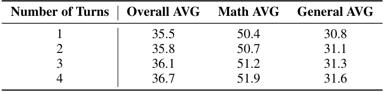)*

**Table_Caption:** Table 9. Ablation study on the number of interaction turns. Increasing turns from 1 to 4 leads to consistent performance gains across all
domains.

**Table_Caption:** able 10. Comprehensive results on mathematical reasoning benchmarks. The peak performance achieved during each model’s trainin
rocess is highlighted in bold.

### VLM Enrichment (table)
Error during async OCR enrichment: too many concurrent requests (status code: 429)

--
*(Original Snippet: 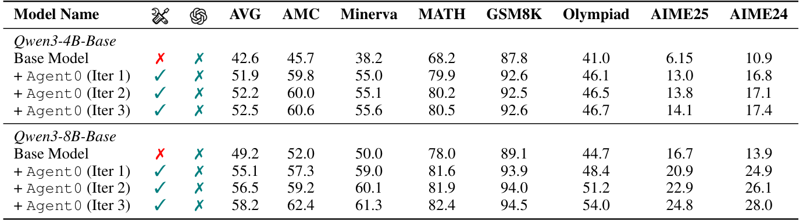)*

## E. Case Analysis

To provide qualitative evidence of the model’s evolution, Table 12, Table 13, Table 14, Table 15, Table 16, Table 17, Table 18,
Table 19, and Table 20 through 9 present three representative questions generated at each stage from Iteration 1 to Iteration
3. We observe a clear progression in difficulty: while the initial iteration features relatively straightforward queries, the
tasks in Iteration 3 evolve into highly complex, multi-step problems requiring deep reasoning. This escalation is driven by
the co-evolutionary dynamic, where the Curriculum Agent, incentivized to maximize the Executor’s learning signal, must
continuously push the difficulty frontier to challenge the Executor’s expanding proficiency, thereby effectively preventing
learning stagnation.

**Table_Caption:** Table 11. Results on general-domain reasoning benchmarks.

### VLM Enrichment (table)
Error during async OCR enrichment: too many concurrent requests (status code: 429)

--
*(Original Snippet: 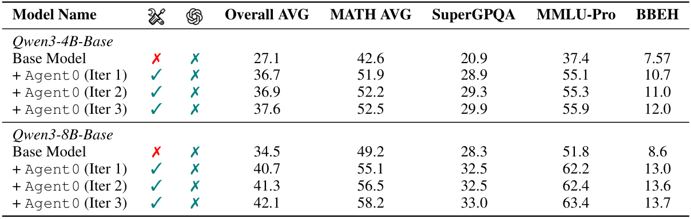)*

**Table_Caption:** Table 12. Sampled questions generated by Curriculum Agent (Iter 1).

## Questions from Curriculum Agent

Let S be the set of all positive integers n for which the polynomial

### VLM Enrichment (isolate_formula)
Error during async OCR enrichment: too many concurrent requests (status code: 429)

--
*(Original Snippet: 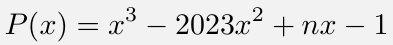)*

has three distinct positive integer roots. Find the sum of all elements in S.

Table 13. Sampled questions generated by Curriculum Agent (Iter 1).

## Table 13. Sampled questions generated by Curriculum Agent (Iter 1).

## Questions from Curriculum Agent

In a triangle ABC with side lengths a, b, and c (where a = BC, b = CA, and c = AB), let the area be K. If the
incircle of the triangle touches BC, CA, and AB at D, E, and F respectively, and the lengths of BD, CE, and
AF are x, y, and z respectively, prove that x2 + y2 + z2 ≥3K
2 .

## Table 14. Sampled questions generated by Curriculum Agent (Iter 1).

## Questions from Curriculum Agent

What is the minimum number of points inside a square with side length 1 that are needed to ensure that at least two
of the points are at most 0.25 units apart from each other?

Table 15. Sampled questions generated by Curriculum Agent (Iter 2).

## Questions from Curriculum Agent

On a 9 × 9 chessboard, initially one cell is black. In each move, you can choose a white cell that has at least one
black cell in the same row or column and invert the color of that chosen cell from white to black. Determine the
minimum number of moves required to turn the entire chessboard into a black board.

## Table 16. Sampled questions generated by Curriculum Agent (Iter 2).

## Questions from Curriculum Agent

Let S = {1, 2, 3, . . . , 100}. A subset A of S is called *good* if for any x, y ∈A (with x ̸= y), the sum x + y is not
a perfect square. Find the maximum possible size of a *good* subset of S.

**Figure_Caption:** Table 17. Sampled questions generated by Curriculum Agent (Iter 2).

## Questions from Curriculum Agent

In the land of Polytopia, each city is represented by a unique point on a large spherical map. The king decides to
create a new city at a special point on this sphere. To determine the location, he uses a sequence of operations on the
coordinates of existing cities.

The map is represented by a sphere where the equation x2 + y2 + z2 = 1 holds for any point (x, y, z) representing
a city. The king chooses two existing cities, A and B, with coordinates (a1, a2, a3) and (b1, b2, b3), respectively. He
defines a new city C with coordinates calculated by the formula:

### VLM Enrichment (isolate_formula)
Error during async OCR enrichment: too many concurrent requests (status code: 429)

--
*(Original Snippet: 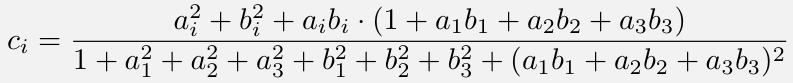)*

for i = 1, 2, 3.

Given that the coordinates of city A are

1
2, 1
2,
√
2
2

and the coordinates of city B are

−1
2, 1
2,
√
2
2

, find the
coordinates of the new city C.

## Questions from Curriculum Agent

A sequence of positive integers a1, a2, a3, . . . , a2024 is defined such that for each n ≥1, the number an+1 is
determined by the rule an+1 = an + ⌊√an⌋, starting with a1 = 1. Find the remainder when a2024 is divided by
1000.

**Figure_Caption:** Table 19. Sampled questions generated by Curriculum Agent (Iter 3).

## Questions from Curriculum Agent

In a knockout tournament with 2n players, where n is a positive integer, each match eliminates one player. The
tournament is structured such that each round halves the number of players. What is the minimum number of
matches that must be played to determine the champion if, for each round, the number of matches played is a
Fibonacci number?

Table 20. Sampled questions generated by Curriculum Agent (Iter 3).

**Figure_Caption:** Table 20. Sampled questions generated by Curriculum Agent (Iter 3).

## Table 20. Sampled questions generated by Curriculum Agent (Iter 3).

## Questions from Curriculum Agent

A circle is divided into 2023 congruent arcs. The endpoints of one arc are colored red and blue. If two points that
are diametrically opposite are both colored red, what is the probability that the two endpoints of the arc directly
adjacent to the red endpoints are both blue? Express your answer as a common fraction.